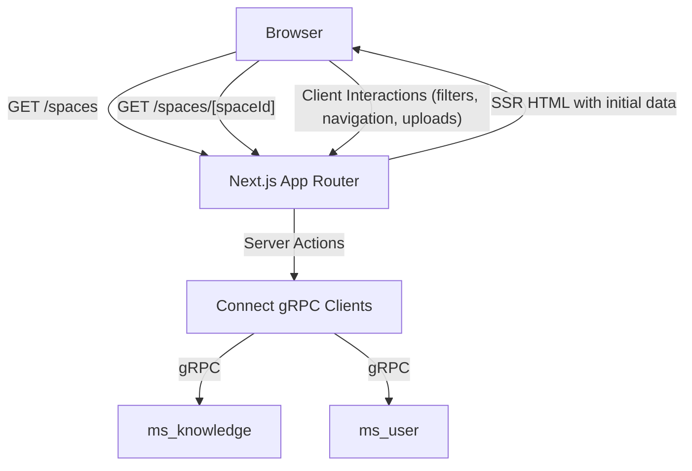

# Design Document: Hybrid Server-First Data Fetching (Spaces & Content)

## 1. Overview
This design aligns with the current codebase, focusing on `/spaces` (list) and `/spaces/[spaceId]` (detail). We will render initial data on the server through existing server actions backed by Connect-based gRPC clients and Clerk auth headers. We add layered caching to reduce duplicate upstream calls and speed up first paint.

## 2. Architecture Design

### 2.1. System Architecture Diagram


### 2.2. Technology Stack
- **Frontend:** Next.js App Router, React 18, TypeScript, Zustand, Radix UI
- **RPC:** `@bufbuild/connect` with `createGrpcTransport`
- **Auth:** Clerk (`auth()` + token in headers via `createAuthHeaders`)
- **Caching:** React `cache` + Next.js `unstable_cache` with tags/time

## 3. Data and Models
No schema changes introduced here. We rely on generated protobuf types for `Space`, `ContentSource`, and `User`.

## 4. Server Actions and Caching

### 4.1 Caching Architecture

#### Dual-Layer Caching Strategy
- **Layer 1: React.cache** - Per-request memoization to prevent duplicate calls within a single render
- **Layer 2: unstable_cache** - Cross-request persistence with tag-based revalidation

#### Cache Key Generation
```typescript
// For complex filters, serialize to stable JSON
const cacheKey = `spaces-list-${userId}-${JSON.stringify(filters)}`;

// Handle undefined/null values consistently
const normalizeFilters = (filters: SpaceFilters) => {
  return {
    q: filters.q || '',
    keywords: filters.keywords || [],
    sortBy: filters.sortBy || 'created',
    sortOrder: filters.sortOrder || 'desc'
  };
};
```

#### TTL Configuration
- **Content Sources**: 60 seconds (frequently changing)
- **Space Details**: 5 minutes (relatively stable)
- **Spaces List**: 5 minutes (moderate frequency changes)

### 4.2 Spaces List (`searchSpaces`)
- Location: `frontend/src/api/actions/spaceActions.ts`
- Inputs: `SpaceFilters` (q, keywords); server constrains to `ownerId` from Clerk.
- Behavior: Calls `listSpaces` on Knowledge service via Connect client.
- Caching:
  - Wrap in `React.cache` to avoid duplicate calls within a single render.
  - Wrap with `unstable_cache` keyed by `spaces-list-{userId}-${JSON.stringify(normalizedFilters)}` with 5-minute TTL.
  - Revalidate on `createSpace`, `updateSpace`, `deleteSpace` via `revalidateTag('spaces-list-{userId}')`.

### 4.3 Space Detail (`getSpace`) + Content Sources (`listContentSources`)
- Locations: `frontend/src/api/actions/spaceActions.ts`, `frontend/src/api/actions/contentActions.ts`
- Behavior: Fetch space by `spaceId`, and processed content sources for that space.
- Caching:
  - `getSpace`: `unstable_cache` with tag `space-{spaceId}` and 5-minute TTL.
  - `listContentSources`: `unstable_cache` with tag `content-sources-{spaceId}` and 60-second TTL.
  - Revalidate on content upload/confirm/delete via `revalidateTag('content-sources-{spaceId}')`.
  - Revalidate space on update via `revalidateTag('space-{spaceId}')`.

### 4.4 Error Handling Strategy
- **Cache Miss**: Normal condition, triggers fresh gRPC fetch
- **gRPC Error**: Propagated to user, no caching of error responses
- **Stale-While-Revalidate**: Serve stale data if fresh fetch fails but cached data exists
- **Partial Revalidation Failures**: Log errors, continue serving stale data until TTL expires

### 4.5 Auth Headers
- Location: `frontend/src/api/actions/utils.ts`
- `createAuthHeaders()` obtains Clerk token and attaches `Authorization: Bearer <token>` for backend calls.

### 4.6 gRPC Clients (Server-Side)
- Location: `frontend/src/api/server-client.ts`
- Singleton pattern via `GRPCClientManager` for User and Knowledge services using `createGrpcTransport` and envs `MS_*_GRPC_URL_INTERNAL`.

## 5. UI/UX Integration

### 5.1 `/spaces` Page
- Location: `frontend/src/app/spaces/page.tsx`
- Server component calls `searchSpaces` to get `initialSpaces`, passes to `SpacesClientPage`.
- Client component (`SpacesClientPage`) handles filters/search and incremental updates.

### 5.2 `/spaces/[spaceId]` Page
- Location: `frontend/src/app/spaces/[spaceId]/page.tsx`
- Server component calls `getSpace` and `listContentSources(spaceId, 'processed')` in parallel and renders the composite layout.
- **Migration**: Remove `dynamic = 'force-dynamic'` and `revalidate = 0` to enable caching.

## 6. API Details (Illustrative)
- No REST endpoints added; uses server actions and Connect gRPC.
- Caching tags proposed:
  - `spaces-list-{userId}`
  - `space-{spaceId}`
  - `content-sources-{spaceId}`

## 7. Security
- All server actions check authentication; unauthenticated requests return a consistent error result.
- Errors sanitized via `sanitizeError`/`sanitizeErrorString`.

## 8. Operations
- Ensure `MS_KNOWLEDGE_GRPC_URL_INTERNAL` and `MS_USER_GRPC_URL_INTERNAL` are configured for all environments.
- Keep Next.js `serverExternalPackages` for grpc deps (see `next.config.ts`).
- **Monitoring**: Add cache hit/miss metrics and performance monitoring for TTL effectiveness.
- **Environment-Specific TTLs**: Consider shorter TTLs in development (30s/2min) for faster iteration.