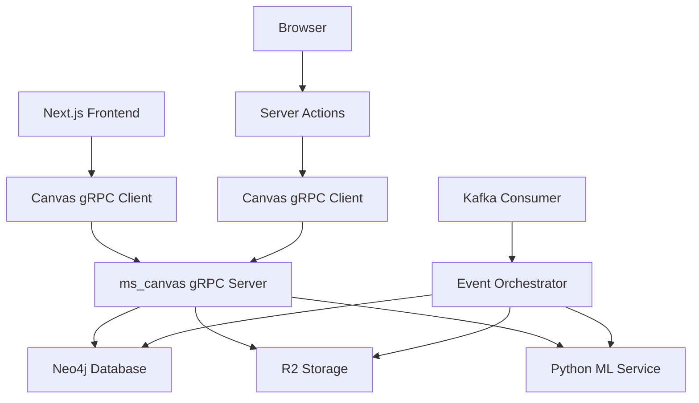
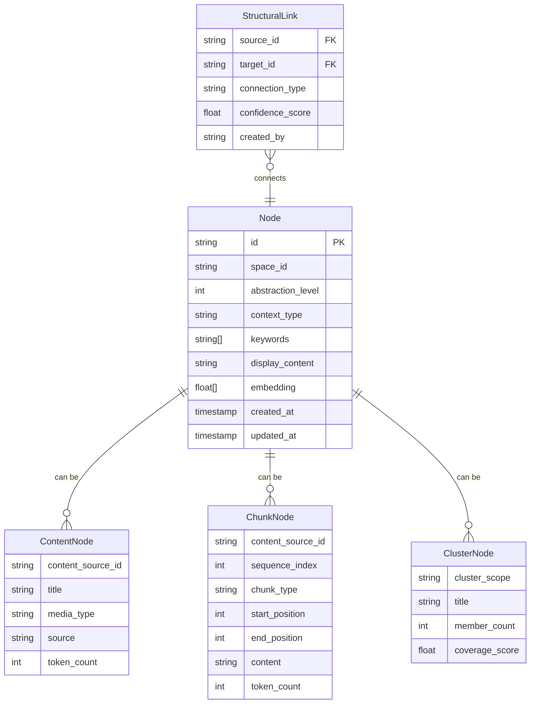
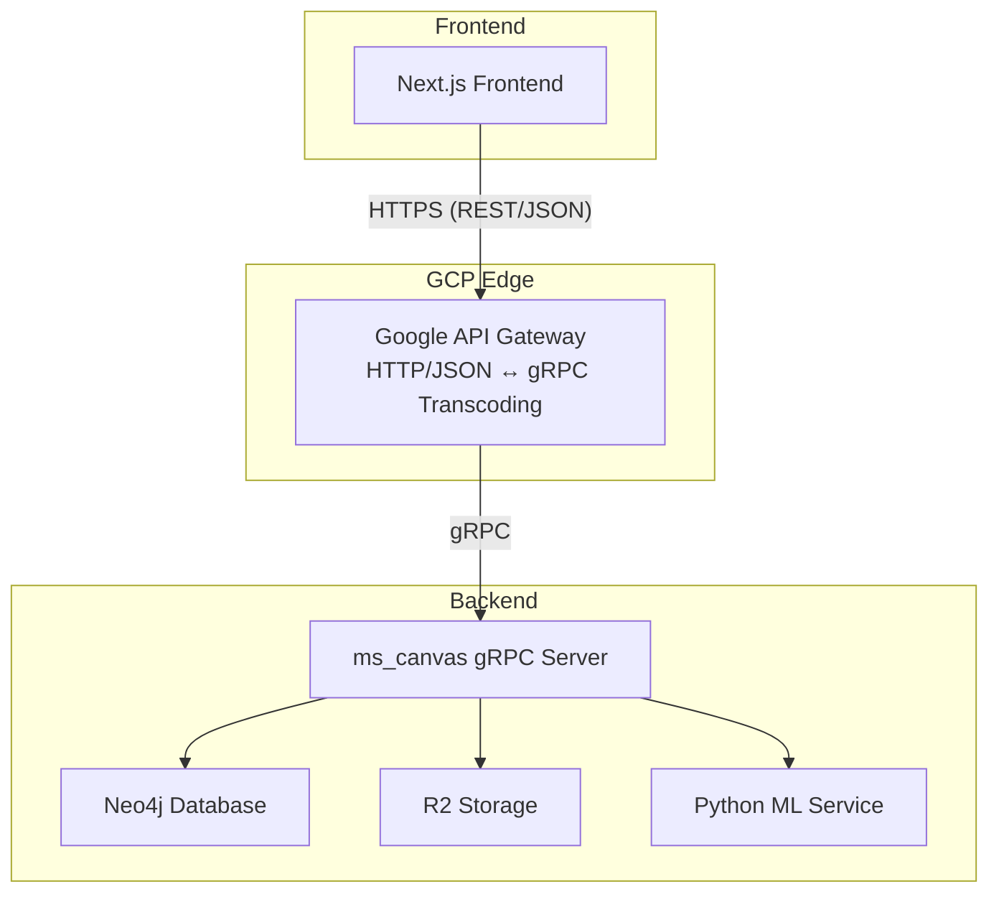

# Design Document: Frontend Data Fetching from ms_canvas

## 1. Overview

This document outlines the technical design for implementing frontend data fetching capabilities from the ms_canvas backend service. The design enables seamless integration between the Next.js frontend and the Go-based ms_canvas microservice, supporting end-to-end testing and basic canvas functionality.

## 2. Architecture Design

### 2.1. System Architecture Diagram


### 2.2. Technology Stack

**Frontend Integration:**
- **gRPC Client Library:** @bufbuild/connect for TypeScript
- **Transport Protocol:** HTTP/2 for server-side gRPC communication
- **Connection Management:** Singleton pattern with connection pooling
- **Error Handling:** Structured error types with retry logic
- **Server Actions:** Direct Server Actions for canvas operations (no extra API routes)

**Backend Services:**
- **ms_canvas:** Go gRPC server with Connect framework on port 50054
- **Direct gRPC Communication:** Following the same pattern as ms_knowledge (port 50052) and ms_user (port 50051)
- **Database:** Neo4j with vector search capabilities
- **Storage:** Cloudflare R2 for processed documents
- **ML Service:** Python gRPC service for chunking and embedding

**Communication Patterns:**
- **Protocol Buffers:** For type-safe API definitions
- **gRPC:** For efficient binary communication
- **Connect:** For protocol compatibility between Go and TypeScript
- **Direct Service Communication:** Following the same pattern as ms_knowledge (port 50052) and ms_user (port 50051)
- **No API Gateway:** Direct gRPC communication for simplicity in demo phase

## 3. Database Design

The frontend fetching functionality leverages the existing Neo4j database schema in ms_canvas:

### 3.1. Node Types and Relationships


## 4. API Endpoint Design

### 4.1. Canvas Public Service Endpoints

#### `GetNodes` - Retrieve Nodes by IDs
- **Description:** Retrieves canvas nodes by their unique identifiers
- **gRPC Method:** `canvas.public.v1.CanvasPublic.GetNodes`
- **Request:**
  ```protobuf
  message GetNodesRequest {
    repeated string ids = 1;
  }
  ```
- **Response:**
  ```protobuf
  message GetNodesResponse {
    repeated Node nodes = 1;
  }
  ```
- **Error Handling:** Returns `INVALID_ARGUMENT` if no IDs provided, `INTERNAL` for database errors

#### `SemanticSearch` - Perform Semantic Search
- **Description:** Searches for nodes using semantic similarity
- **gRPC Method:** `canvas.public.v1.CanvasPublic.SemanticSearch`
- **Request:**
  ```protobuf
  message SemanticSearchRequest {
    string query = 1;
    string space_id = 2;
    int32 top_k = 3;
    repeated NodeType node_types = 4;
  }
  ```
- **Response:**
  ```protobuf
  message SemanticSearchResponse {
    repeated SearchResult results = 1;
  }

  message SearchResult {
    Node node = 1;
    double score = 2;
  }
  ```
- **Error Handling:** Returns `INVALID_ARGUMENT` for empty queries, `INTERNAL` for ML service errors

#### `SearchNodes` - Spatial and Filter-based Search
- **Description:** Searches nodes using filters and spatial bounds
- **gRPC Method:** `canvas.public.v1.CanvasPublic.SearchNodes`
- **Request:**
  ```protobuf
  message SearchNodesRequest {
    NodeFilter filter = 1;
    SpatialBoundingBox spatial_bbox = 2;
    int32 limit = 3;
  }
  ```
- **Response:**
  ```protobuf
  message SearchNodesResponse {
    repeated Node nodes = 1;
  }
  ```
- **Error Handling:** Returns `INVALID_ARGUMENT` for invalid filters, `INTERNAL` for database errors

## 5. Frontend Integration Design

### 5.1. Client Architecture

**Service Client Manager (Server-Side Only):**
- **Singleton Pattern:** Ensures single gRPC connection per service type
- **Usage:** Consumed exclusively by Next.js Server Actions to keep credentials serverside
- **Environment Configuration:** Supports internal URLs for dev/prod
- **Error Recovery:** Automatic retry with exponential backoff
- **Direct gRPC Communication:** Following the same pattern as ms_knowledge and ms_user

**Transport Configuration (examples):
- Server-side HTTP/2 via connect-node**
```typescript
// Direct gRPC transport (same as ms_knowledge and ms_user)
const transport = createGrpcTransport({
  httpVersion: '2',
  baseUrl: 'http://localhost:50054',  // Direct connection to ms_canvas
});
});

// Server-side HTTP/2 transport
const serverTransport = createGrpcTransport({
  baseUrl: 'http://localhost:50055',
  httpVersion: '2',
});
```
Note: For this project, use the server-side transport from Server Actions. Prefer not to expose grpc-web unless needed for streaming.

### 5.2. Error Handling Strategy

**Error Types:**
- **ConnectionError:** Network or gRPC connection failures
- **ValidationError:** Invalid request parameters
- **ServiceError:** Backend service unavailable or errors
- **TimeoutError:** Request timeout exceeded

**Retry Logic:**
- **Exponential Backoff:** 1s, 2s, 4s, 8s delays
- **Max Retries:** 3 attempts for transient errors
- **Non-Retryable:** Validation errors, authentication failures

### 5.3. State Management

**React Query Integration:**
- **Caching:** Automatic caching of search results
- **Background Updates:** Refetch on window focus
- **Optimistic Updates:** UI updates before server confirmation
- **Error Boundaries:** Graceful error display

**Local State:**
- **Loading States:** Per-operation loading indicators
- **Error States:** User-friendly error messages
- **Retry Actions:** Manual retry buttons for failed operations

## 6. Security Considerations

### 6.1. Authentication
- **gRPC Metadata:** JWT tokens in request headers
- **Service Account:** Internal service-to-service authentication
- **CORS:** Proper CORS configuration for browser requests

### 6.2. Rate Limiting
- **Client-side:** Request throttling to prevent abuse
- **Server-side:** Backend rate limiting on gRPC endpoints
- **Error Handling:** Graceful degradation under load

## 7. Performance Optimization

### 7.1. Caching Strategy
- **Browser Cache:** Service Worker caching for static assets
- **Memory Cache:** In-memory caching for frequent queries
- **CDN:** Static asset delivery optimization

### 7.2. Bundle Optimization
- **Code Splitting:** Dynamic imports for route-based loading
- **Tree Shaking:** Remove unused code from bundles
- **Compression:** Gzip compression for all assets

### 7.3. Monitoring
- **Performance Metrics:** Response times, error rates
- **User Analytics:** Feature usage tracking
- **Error Tracking:** Sentry integration for production errors


## Addendum A: Google API Gateway for ms_canvas (gRPC → HTTP Transcoding)

This addendum amends the architecture to route frontend requests for `ms_canvas` through Google Cloud API Gateway, which performs HTTP/JSON ↔ gRPC transcoding. The `ms_canvas` service remains a gRPC server; no HTTP layer is added to the service. Only `ms_canvas` is included in this phase.

### A.1 Updated Architecture



### A.2 REST Mappings (Examples)

The following REST endpoints are exposed by API Gateway and map to `canvas.public.v1.CanvasPublic` methods:

- `GET /v1/canvas/nodes?ids=ID1&ids=ID2...` → `GetNodes`
- `POST /v1/canvas/semanticSearch` (JSON body of `SemanticSearchRequest`) → `SemanticSearch`
- `POST /v1/canvas/searchNodes` (JSON body of `SearchNodesRequest`) → `SearchNodes`

Request/response JSON structures follow proto field names; enum and repeated fields are supported per API Gateway transcoding rules.

### A.3 Frontend Integration Pattern

- Introduce `NEXT_PUBLIC_CANVAS_HTTP_BASE` (e.g., `https://<gateway-host>`)
- Fetch via `fetch(\"${NEXT_PUBLIC_CANVAS_HTTP_BASE}/v1/canvas/...\")`
- Reuse existing server-action patterns for auth and caching; replace gRPC calls with HTTP to API Gateway for `ms_canvas` only.

Example:
```ts
const base = process.env.NEXT_PUBLIC_CANVAS_HTTP_BASE!;
const q = new URLSearchParams(ids.map((id) => ["ids", id] as const));
const res = await fetch(`${base}/v1/canvas/nodes?${q.toString()}`, {
  headers: { Authorization: `Bearer ${token}` },
});
const data = await res.json();
```

### A.4 Security & Auth

- Use Bearer JWT in `Authorization` header; API Gateway validates and forwards context to backend per its configuration.
- CORS must be enabled on API Gateway if called directly from the browser; when using Next.js server actions, calls can be proxied server-side to avoid CORS.

### A.5 Scope & Non-Goals (Phase 1)

- Scope: `ms_canvas` only
- Non-goals: Migrating `ms_user` or `ms_knowledge` to API Gateway in this phase; existing gRPC server actions remain for those services

