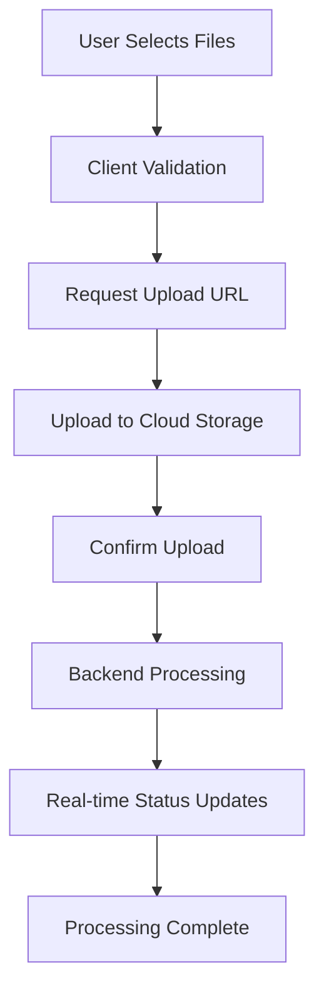

# Design Document

## Overview

This design document outlines the comprehensive enhancement of the Knowledge Spaces frontend interface, focusing on updating the /spaces page styling and completing the spaces/[spaceId] functionality. The design leverages the existing component examples and follows modern React patterns with Next.js 14+ features including parallel routes, server actions, and optimistic updates.

## Architecture

### Component Architecture

```
frontend/src/app/spaces/
├── @modal/                           # Parallel routes for modals
│   ├── (.)create/
│   │   └── page.tsx                 # Create space modal (existing)
│   ├── (.)upload/[spaceId]/
│   │   └── page.tsx                 # Upload content modal (new)
│   ├── (.)documents/[spaceId]/
│   │   └── page.tsx                 # Documents list modal (new)
│   └── default.tsx
├── [spaceId]/                       # Individual space pages
│   ├── @uploadModal/                # Parallel route for upload on space page
│   │   ├── (.)upload/
│   │   │   └── page.tsx            # Upload modal intercepted route
│   │   └── default.tsx
│   ├── components/
│   │   ├── SpaceHeader.tsx         # Space title, description, metadata
│   │   ├── SpaceCanvas.tsx         # Main canvas/mind map area
│   │   ├── DocumentsSection.tsx    # Documents management panel
│   │   ├── ChatSection.tsx         # Chat interface panel
│   │   ├── ContentSourceCard.tsx   # Individual document card
│   │   └── UploadModal.tsx         # Upload modal component
│   ├── layout.tsx                  # Space layout with upload modal slot
│   └── page.tsx                    # Space detail page
├── components/                      # Updated components
│   ├── SpaceCard.tsx               # Enhanced with new styling
│   ├── GalleryView.tsx             # Updated gallery layout
│   ├── ListView.tsx                # Enhanced list view
│   ├── CanvasView.tsx              # Updated canvas view
│   ├── SpaceFilters.tsx            # Sidebar filters (existing)
│   ├── CreateSpaceForm.tsx         # Space creation form (existing)
│   └── UploadTabs.tsx              # Upload method tabs (new)
├── hooks/
│   ├── useSpaces.ts                # Space data management (existing)
│   ├── useUpload.ts                # Upload functionality (new)
│   └── useSpaceFilters.ts          # Filter management (existing)
├── types/
│   └── spaces.ts                   # Enhanced type definitions
├── layout.tsx                      # Spaces layout with modal slots
├── loading.tsx                     # Loading skeleton
├── page.tsx                        # Main spaces page
└── SpacesClientPage.tsx            # Client-side main component
```

### State Management Architecture

```typescript
// Enhanced state management for spaces and content
interface SpacesState {
  // Existing state
  spaces: Space[]
  currentView: 'gallery' | 'list' | 'canvas'
  filters: SpaceFilters
  
  // New state for content management
  contentSources: Record<string, ContentSource[]>  // spaceId -> content sources
  uploadProgress: Record<string, UploadProgress>   // fileId -> progress
  processingStatus: Record<string, ProcessingStatus> // contentId -> status
}

interface UploadProgress {
  fileId: string
  filename: string
  progress: number
  status: 'uploading' | 'processing' | 'completed' | 'failed'
}
```

## Components and Interfaces

### Enhanced SpaceCard Component

Based on the provided example, the SpaceCard component includes:

**Visual Elements:**
- Cover image with gradient overlay and hover scale effect
- Space icon and title with proper typography
- Access level badge with appropriate colors and icons
- Keywords display with overflow handling
- Document count and metadata display
- Hover-triggered edit button

**Interaction Patterns:**
- Click to navigate to space detail page
- Hover effects for visual feedback
- Edit button reveals on hover
- Tooltip with extended information
- Responsive design for different screen sizes

**Styling Approach:**
```css
.space-card {
  @apply bg-white border border-gray-200 rounded-xl shadow-sm hover:shadow-md;
  @apply transition-all duration-200 relative group overflow-hidden;
}

.space-card:hover {
  @apply transform -translate-y-1;
}

.cover-image {
  @apply transition-transform duration-200 group-hover:scale-105;
}
```

### Upload Modal System

**Modal Structure:**
- Uses Next.js parallel routes for proper modal handling
- Tabbed interface for different upload methods
- Drag and drop file upload area
- Progress tracking for multiple concurrent uploads
- Real-time status updates

**Upload Methods:**
1. **File Upload**: Drag & drop with progress bars
2. **Google Drive**: OAuth integration with file picker
3. **Link**: URL input with automatic content extraction
4. **Paste Text**: Direct text input with title and content fields

**File Processing Flow:**


### Space Detail Page Layout

**Three-Column Layout:**
1. **Left Sidebar**: Navigation and space metadata
2. **Main Canvas**: Interactive mind map and content visualization
3. **Right Panel**: Documents list and chat interface

**Responsive Behavior:**
- Desktop: Three-column layout
- Tablet: Collapsible sidebar, two-column main area
- Mobile: Stacked layout with tab navigation

### Enhanced View Components

**Gallery View Enhancements:**
- Grid size controls (small, medium, large)
- Improved card hover effects
- Better empty state design
- Responsive grid layouts

**List View Enhancements:**
- Sortable columns with visual indicators
- Inline editing capabilities
- Improved table styling
- Fixed header with scrollable body

**Canvas View Enhancements:**
- Carousel-style navigation
- 3D depth effect with side cards
- Interactive mini-map
- Full-screen preview modal

## Data Models

### Enhanced Space Model

```typescript
interface Space {
  id: string
  title: string
  description?: string
  icon: string
  cover_image: string
  keywords: string[]
  access_level: 'private' | 'shared' | 'public'
  document_count: number
  total_size_bytes: number
  created_at: Date
  last_updated_at: Date
  
  // New fields for enhanced functionality
  canvas_data?: CanvasData
  collaboration_settings?: CollaborationSettings
  processing_stats?: ProcessingStats
}

interface CanvasData {
  nodes: CanvasNode[]
  connections: CanvasConnection[]
  layout: CanvasLayout
}

interface ContentSource {
  id: string
  space_id: string
  filename?: string
  title?: string
  mime_type: string
  size_bytes: number
  upload_url?: string
  processing_status: 'pending' | 'processing' | 'completed' | 'failed'
  created_at: Date
  updated_at: Date
  
  // Content-specific fields
  source_type: 'file' | 'url' | 'text' | 'google_drive'
  source_metadata?: Record<string, any>
  extracted_text?: string
  thumbnail_url?: string
}
```

### Upload Management Models

```typescript
interface UploadSession {
  id: string
  space_id: string
  files: UploadFile[]
  status: 'active' | 'completed' | 'cancelled'
  created_at: Date
}

interface UploadFile {
  id: string
  filename: string
  size_bytes: number
  mime_type: string
  upload_url: string
  progress: number
  status: 'pending' | 'uploading' | 'processing' | 'completed' | 'failed'
  error_message?: string
}
```

## Error Handling

### Upload Error Handling

**Client-Side Validation:**
- File type validation (PDF, .txt, Markdown, Audio)
- File size limits (configurable per plan)
- Duplicate file detection
- Network connectivity checks

**Server-Side Error Recovery:**
- Retry mechanisms for failed uploads
- Partial upload resumption
- Graceful degradation for processing failures
- Clear error messaging with actionable steps

**Error States:**
```typescript
interface ErrorState {
  type: 'validation' | 'network' | 'server' | 'processing'
  message: string
  code: string
  retryable: boolean
  actions?: ErrorAction[]
}

interface ErrorAction {
  label: string
  action: () => void
  variant: 'primary' | 'secondary' | 'destructive'
}
```

### Modal Error Handling

**Navigation Errors:**
- Fallback to regular page navigation if parallel routes fail
- Proper error boundaries for modal content
- Graceful modal dismissal on errors

**Form Validation:**
- Real-time validation feedback
- Field-level error messages
- Form submission error handling
- Optimistic update rollback on failure

## Testing Strategy

### Component Testing

**Unit Tests:**
- Component rendering with various props
- User interaction handling
- State management logic
- Error boundary behavior

**Integration Tests:**
- Modal navigation flows
- Upload functionality end-to-end
- Server action integration
- Real-time updates

### Visual Testing

**Responsive Design:**
- Component behavior across breakpoints
- Layout integrity on different screen sizes
- Touch interaction on mobile devices

**Accessibility Testing:**
- Keyboard navigation
- Screen reader compatibility
- Focus management in modals
- Color contrast compliance

### Performance Testing

**Upload Performance:**
- Large file upload handling
- Multiple concurrent uploads
- Progress tracking accuracy
- Memory usage optimization

**Rendering Performance:**
- Large space lists rendering
- Modal opening/closing performance
- Image loading optimization
- Scroll performance in lists

## Implementation Considerations

### Next.js 14+ Features

**Parallel Routes:**
- Proper modal implementation using @modal slots
- Intercepting routes for seamless navigation
- Fallback handling for direct URL access

**Server Actions:**
- Form submissions with progressive enhancement
- Optimistic updates for better UX
- Error handling and validation
- File upload integration

**Streaming and Suspense:**
- Progressive loading of space data
- Skeleton components during loading
- Streaming updates for real-time features

### Performance Optimizations

**Image Optimization:**
- Next.js Image component for cover images
- Lazy loading for off-screen content
- Responsive image sizing
- WebP format support

**Code Splitting:**
- Route-based code splitting
- Dynamic imports for heavy components
- Lazy loading of upload functionality

**Caching Strategy:**
- Server-side caching for space data
- Client-side caching with SWR/React Query
- Optimistic updates for immediate feedback

### Accessibility Considerations

**Keyboard Navigation:**
- Tab order management in modals
- Arrow key navigation in grids
- Escape key handling for modal dismissal

**Screen Reader Support:**
- Proper ARIA labels and descriptions
- Live regions for dynamic updates
- Semantic HTML structure

**Visual Accessibility:**
- High contrast mode support
- Reduced motion preferences
- Focus indicators
- Color-blind friendly design

This design provides a comprehensive foundation for implementing the enhanced spaces functionality while maintaining consistency with the existing codebase and following modern web development best practices.