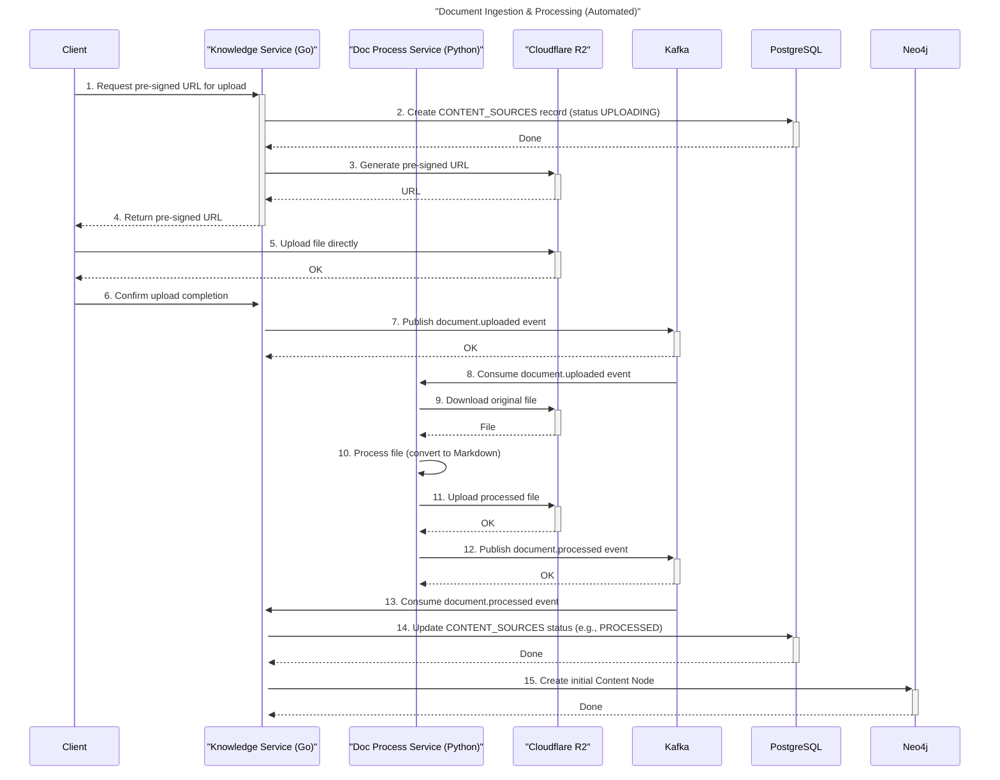
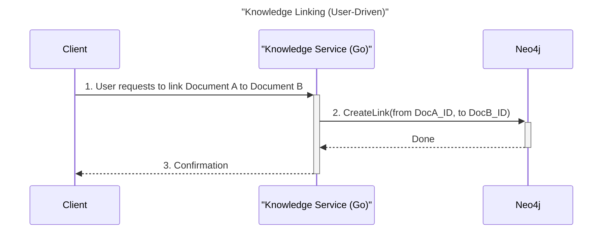

# Milestone Implementation Plan: Knowledge & Document Process Services

This document outlines the implementation plan for creating the `Knowledge Service` and the `Document Process Service`.

---

## Phase 1: Project Setup & Core Infrastructure

- [x] **Project Scaffolding**
    - [x] Create a new directory for the Knowledge Service: `ms_knowledge`.
    - [x] Initialize a Go project within `ms_knowledge` (`go mod init`).
    - [x] Create a new directory for the Document Process Service: `ms_document_process`.
    - [x] Initialize a Python project within `ms_document_process` using Poetry.

- [x] **Containerization & Orchestration**
    - [x] Create a `Dockerfile` for the `ms_knowledge` service.
        - `ms_knowledge/Dockerfile`
    - [x] Create a `Dockerfile` for the `ms_document_process` service.
        - `ms_document_process/Dockerfile`
    - [x] Update the root `docker-compose.yml` to include the new services (`ms_knowledge`, `ms_document_process`), PostgreSQL, and Neo4j. Kafka will be provided by AWS MSK Serverless (managed) and is not part of Docker Compose.
        - `docker-compose.yml`
    - [ ] Provision AWS MSK Serverless (managed Kafka)
        - [x] In AWS Console → MSK → Create cluster → select "Serverless" and note the region
        - [x] After the cluster is active, open the cluster → "View client information" → copy the Bootstrap servers (TLS)
        - [ ] Create topics: `document.uploaded` and `document.processed`
        - [ ] Configure IAM access (runtime role for cloud; AWS credentials for local dev)
        - Environment variables:
            - `KAFKA_BROKERS` = the MSK Bootstrap servers (TLS)
            - `AWS_REGION` = MSK cluster region
            - (local dev) `AWS_ACCESS_KEY_ID`, `AWS_SECRET_ACCESS_KEY`, optional `AWS_SESSION_TOKEN`

- [x] **Configuration**
    - [x] Set up a configuration loading mechanism (e.g., Viper in Go, Pydantic Settings in Python) for both services.
        - `ms_knowledge/internal/config/config.go`
        - `ms_knowledge/internal/secrets/`
        - `ms_document_process/app/config/config.py`
    - [x] Define environment variables for database connections (Postgres, Neo4j), Cloudflare R2 credentials, and AWS MSK Serverless connectivity.
        - Kafka/MSK: `KAFKA_BROKERS`, `AWS_REGION`; optional for local dev: `AWS_ACCESS_KEY_ID`, `AWS_SECRET_ACCESS_KEY`, `AWS_SESSION_TOKEN`
    - [x] Create `.env.local.example` files for both services.
        - `ms_knowledge/.env.local.example`
        - `ms_document_process/.env.local.example`

---

## Phase 2: Database & Schema Setup

- [x] **PostgreSQL (Knowledge Service)**
    - [x] Define the Ent schema for the `SPACES` table in `ms_knowledge/ent/schema/space.go`.
    - [x] Define the Ent schema for the `CONTENT_SOURCES` table in `ms_knowledge/ent/schema/contentsource.go`.
    - [x] Decision: Do not create Ent schema for `KNOWLEDGE_CONTENT_BLOBS` (managed in R2; keep only hash fields on `CONTENT_SOURCES`).
    - [x] Run `go generate ./ent` to create the Ent ORM code.
    - [x] Generate the initial database migration file.

- [x] **Neo4j (Knowledge Service)**
    - [x] Define a repository interface in the `domain` layer for graph operations.
        - `CreateContentNode(ctx, contentID)`
        - `CreateLink(ctx, fromContentID, toContentID)`
        - `GetBacklinks(ctx, contentID)`
    - [x] Implement the Neo4j repository using the official Neo4j Go driver.

- [x] **Cloudflare R2 Storage**
    - [x] Create a client/helper package in both services to interact with R2.
        - `Upload(bucket, key, data)`
        - `GeneratePresignedUploadURL(bucket, key)`
        - `Download(bucket, key)`
        - `CalculateSHA256(data)`

---

## Phase 3: Knowledge Service (`ms_knowledge` - Go)

- [ ] **API Definition (gRPC)**
	- [ ] Create `knowledge.proto` under `ms_knowledge/api/proto/v1/`.
	- [ ] Define messages:
		- `Space` with rich fields: `id`, `name`, `description`, `owner_id`, `org_id`, `created_at`, `updated_at`, `stats`, and lightweight `content_summary` for related entities.
		- `ContentSource` with `id`, `space_id`, `status`, `original_blob_hash`, `processed_blob_hash`, `mime_type`, `size_bytes`, `title`, timestamps.
		- `KnowledgeLink` representing document-document relationships: `id`, `from_content_id`, `to_content_id`, `relation_type`, `weight`, timestamps.
		- Common paging and filtering: `Pagination` (page_size, page_token, next_page_token) and list response wrappers.
		- `HealthStatus` for service health.
	- [ ] Define the `KnowledgeService` with the following RPCs:
		- Spaces
			- `rpc CreateSpace(CreateSpaceRequest) returns (Space)`
			- `rpc GetSpace(GetSpaceRequest) returns (Space)`  // includes joined/denormalized details via foreign keys
			- `rpc ListSpaces(ListSpacesRequest) returns (ListSpacesResponse)`  // pagination, keyword, owner/org filters
			- `rpc UpdateSpace(UpdateSpaceRequest) returns (Space)`
			- `rpc DeleteSpace(DeleteSpaceRequest) returns (google.protobuf.Empty)`
		- Content Sources
			- `rpc CreateUploadURL(CreateUploadURLRequest) returns (CreateUploadURLResponse)`
			- `rpc ConfirmUpload(ConfirmUploadRequest) returns (ContentSource)`  // mark as UPLOADED and emit event
			- `rpc GetContentSource(GetContentSourceRequest) returns (ContentSource)`
			- `rpc ListContentSources(ListContentSourcesRequest) returns (ListContentSourcesResponse)`
			- `rpc UpdateContentSourceStatus(UpdateContentSourceStatusRequest) returns (ContentSource)`
		- Knowledge Graph (document-document relationships; CRUO)
			- `rpc CreateKnowledgeLink(CreateKnowledgeLinkRequest) returns (KnowledgeLink)`
			- `rpc GetKnowledgeLink(GetKnowledgeLinkRequest) returns (KnowledgeLink)`
			- `rpc ListKnowledgeLinks(ListKnowledgeLinksRequest) returns (ListKnowledgeLinksResponse)`  // by content_id, direction INBOUND/OUTBOUND, type, pagination
			- `rpc UpdateKnowledgeLink(UpdateKnowledgeLinkRequest) returns (KnowledgeLink)`
			- `rpc DeleteKnowledgeLink(DeleteKnowledgeLinkRequest) returns (google.protobuf.Empty)`
		- Utilities
			- `rpc SearchSpaces(SearchSpacesRequest) returns (ListSpacesResponse)`
			- `rpc Healthz(google.protobuf.Empty) returns (HealthStatus)`
	- [ ] Generate Go gRPC server and client code.

- [ ] **Repository Layer**
	- [ ] Implement the PostgreSQL repository using the generated Ent client for all required CRUD operations on the defined schemas.
		- Space Repository:
			- Create, Get (by id), List (pagination, keyword, owner_id, org_id filters), Update (name, description, owner transfer), Delete (soft/hard per design)
		- ContentSource Repository:
			- Create (initial record), Get (by id), List (by space_id, status, pagination), UpdateStatus, UpdateProcessedHash, Update metadata fields
	- [ ] Implement the Neo4j repository as defined in Phase 2 and extended for link CRUO.
		- KnowledgeLink Repository (Neo4j):
			- CreateLink(from_content_id, to_content_id, relation_type, weight)
			- GetLink(link_id)
			- ListLinks(content_id, direction INBOUND/OUTBOUND/BOTH, relation_type, pagination)
			- UpdateLink(link_id, relation_type, weight)
			- DeleteLink(link_id)
			- GetBacklinks(content_id)  // convenience for inbound links

 - [ ] **Event Integration (Kafka via AWS MSK Serverless)**
    - [ ] Implement a Kafka **Producer** configured for AWS MSK IAM authentication and TLS.
        - Use brokers from `KAFKA_BROKERS`; region from `AWS_REGION`.
        - Local dev: use AWS credentials from env; cloud runtime: use IAM role.
    - [ ] Define topics: `document.uploaded` and `document.processed`.
    - [ ] Implement a Kafka **Consumer** for `document.processed` with the same IAM/TLS settings.
        - The consumer will handle messages indicating success or failure from the `ms_document_process` service.
        - Logic to update the `CONTENT_SOURCES` status to `PROCESSED` or `FAILED` and store the `processed_blob_hash`.
        - Upon successful processing, the consumer will create the initial `ContentNode` in Neo4j.

- [ ] **Service Layer**
	- [ ] Implement the business logic for `Space` management.
		- CreateSpace, GetSpace (enriched with aggregated stats and summarized related entities), ListSpaces, UpdateSpace, DeleteSpace, SearchSpaces
    - [ ] Implement the core content upload workflow:
        1.  An initial `CreateUploadURL` RPC is called.
        2.  The service creates a `CONTENT_SOURCES` record with `status: UPLOADING`.
        3.  The service creates a `KNOWLEDGE_CONTENT_BLOBS` record for the original file hash.
        4.  The service returns a pre-signed URL from R2 for the client to upload the file directly.
	- [ ] Implement the logic to handle confirmation of a successful client upload.
        - Upon confirmation, publish a message to the `document.uploaded` Kafka topic. The message should contain the necessary context, such as the `content_source_id` and `original_blob_hash`.
	- [ ] Implement the business logic for content sources: GetContentSource, ListContentSources, UpdateContentSourceStatus, and ConfirmUpload orchestration.
	- [ ] Implement the business logic for knowledge graph links (document-document): CreateKnowledgeLink, GetKnowledgeLink, ListKnowledgeLinks, UpdateKnowledgeLink, DeleteKnowledgeLink, and `GetBacklinks` convenience.

- [ ] **Server Layer**
    - [ ] Implement the gRPC handlers defined in the `.proto` file.
    - [ ] Connect the handlers to the service layer methods.
    - [ ] Set up the main gRPC server in `cmd/server/main.go`.

---

## Phase 4: Document Process Service (`ms_document_process` - Python)

 - [ ] **Event Integration (Kafka via AWS MSK Serverless)**
    - [ ] Implement a Kafka **Consumer** on `document.uploaded` using IAM-authenticated, TLS-secured connectivity to AWS MSK Serverless.
    - [ ] Implement a Kafka **Producer** to publish results to `document.processed` with the same IAM/TLS settings.

- [ ] **API Definition (gRPC)**
    - [ ] Create `document_process.proto` under `ms_document_process/api/proto/v1/`.
    - [ ] Define `ProcessDocumentRequest` containing the `original_blob_hash`.
    - [ ] Define `ProcessDocumentResponse` containing the `processed_blob_hash` and `status`.
    - [ ] Define the `DocumentProcessService` with a single RPC:
        - `rpc ProcessDocument(ProcessDocumentRequest) returns (ProcessDocumentResponse)`
    - [ ] Generate Python gRPC server and client code.

- [ ] **gRPC Client for Knowledge Service**
    - [ ] Create a gRPC client to communicate with the `ms_knowledge` service.
    - [ ] This client will be used to call `UpdateContentSourceStatus` upon job completion or failure.

- [ ] **Core Logic (Service Layer)**
    - [ ] Implement the file download logic from R2 using the `original_blob_hash`.
    - [ ] Integrate libraries for document transformation (e.g., `pypdf`, `python-docx`, `beautifulsoup4`, `markdown-it-py`).
    - [ ] Implement the core transformation logic to convert source files into clean Markdown.
    - [ ] Implement logic to calculate the SHA-256 hash of the processed Markdown content.
    - [ ] Implement the file upload logic to save the processed Markdown to R2.

- [ ] **Job Orchestration**
    - [ ] The Kafka consumer will orchestrate the download, process, and upload steps.
    - [ ] After processing, the orchestrator will publish a message to the `document.processed` topic with the outcome (`status: 'PROCESSED'` or `status: 'FAILED'`), the original `content_source_id`, and the `processed_blob_hash` (if successful). Messages are sent via AWS MSK Serverless with IAM/TLS.
    - [ ] **Error Handling:**
        - Implement a retry mechanism for processing jobs with a **maximum of 3 retries** for transient errors.
        - If a job fails after 3 retries, publish a `FAILED` status message to Kafka. Consider sending these persistent failures to a dead-letter queue (DLQ) for manual inspection.

- [ ] **Server Layer**
    - [ ] Implement the `ProcessDocument` gRPC handler.
    - [ ] The handler orchestrates the download, process, and upload steps.
    - [ ] After processing, the handler uses the gRPC client to notify the `ms_knowledge` service of the result.
    - [ ] Set up the main gRPC server in `app/main.py`.

---

## Phase 5: Service Integration & Workflow

- [ ] **End-to-End Workflow**
    - [ ] **Automated Ingestion:**
        - The `ms_knowledge` service receives a request and returns a pre-signed URL.
        - After the client uploads the file, `ms_knowledge` publishes an event to Kafka (AWS MSK Serverless).
        - `ms_document_process` consumes the event, downloads, processes, and re-uploads the file.
        - `ms_document_process` publishes a result event back to Kafka (AWS MSK Serverless).
        - `ms_knowledge` consumes the result, updates the content source's status, and creates the initial `ContentNode` in Neo4j.
    - [ ] **User-Driven Linking:**
        - The client sends a `CreateKnowledgeLink` request to the `ms_knowledge` service.
        - The service validates the request and instructs Neo4j to create the relationship between the two content nodes.

- [ ] **Error Handling**
    - [ ] Implement robust error handling for failed processing jobs. The `status` in `CONTENT_SOURCES` should be set to `FAILED`.
    - [ ] Implement retries with exponential backoff for transient network errors in service-to-service communication.

---

## Phase 6: Testing

- [ ] **Unit Tests**
    - [ ] Write unit tests for the service layer logic in both services.
    - [ ] Write unit tests for the repository layer, mocking database and Kafka dependencies.

- [ ] **Integration Tests**
    - [ ] Write integration tests for the full document upload and processing workflow using Docker Compose to spin up dependent services (Postgres, Neo4j). Kafka will target the external AWS MSK Serverless cluster; ensure test credentials/roles are configured.