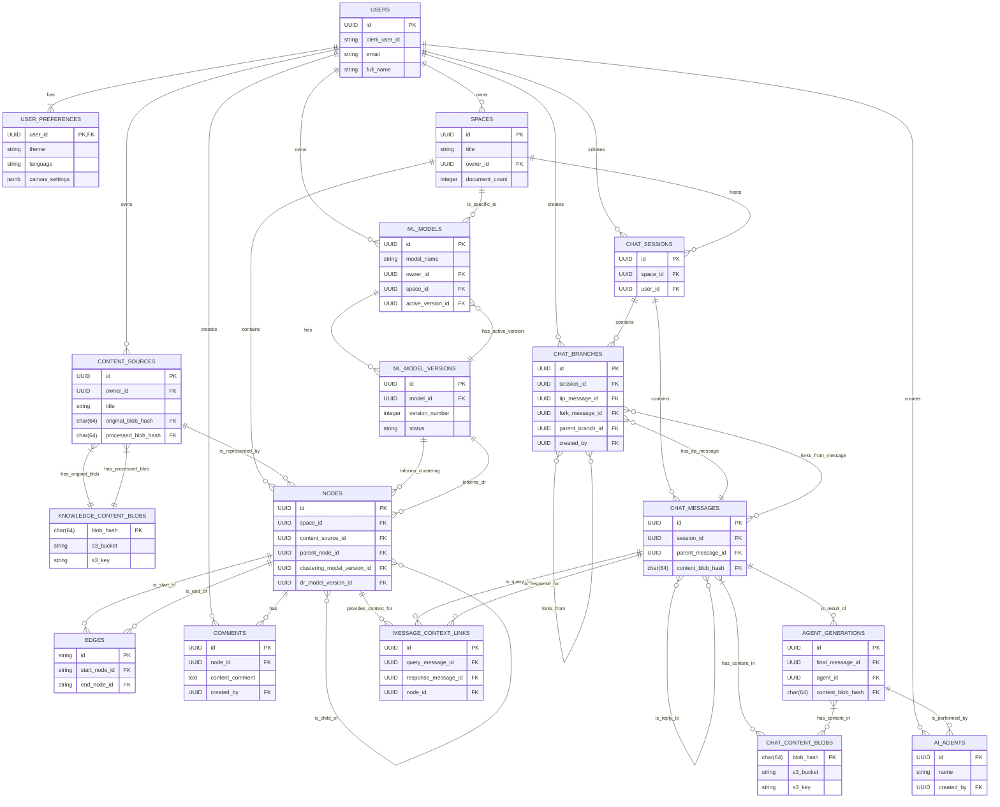

# Database Schema for Knowledge Space - Version 2

## Core Design Principles

1. **Unified Node Hierarchy**: All entities (content sources, content chunks, clusters) are represented as nodes with flexible parent-child relationships
2. **Separation of Display vs Retrieval**: Clear distinction between text for UI display and text for vector search
3. **Scalable Clustering**: No fixed hierarchy levels - clusters can contain clusters to any depth
4. **Global vs Space Context**: Knowledge exists globally but can be organized differently in each space

## Service Architecture Overview

The following diagram illustrates the microservice boundaries and the key entities within each service:



This architecture demonstrates the clear separation of concerns across six distinct services:
- **User Service**: User management and preferences
- **Knowledge Service**: Content sources and blob storage (Postgres + object storage)
- **Canvas Service**: Unified graph + vector store (Neo4j) for interactive node visualization and hybrid semantic-structural retrieval; stores nodes, relationships, and embeddings as the canonical canvas representation
- **Vector Service**: Embeddings generation and specialized vector stores (Qdrant) for legacy or external collections and per-user private vectors
- **ML Service**: Machine learning models and versioning
- **Chat Service**: Conversational AI and agent orchestration

---

## Knowledge Service
This service is responsible for managing the core entities of the platform: knowledge spaces and the content sources within them. It handles creation, metadata, storage quotas, and the lifecycle of all ingested content. Utilize Cloudflare R2 for blob storage.

### `SPACES`: Knowledge Space Entity
| Field Name            | Data Type      | Description                                                  |
|-----------------------|----------------|--------------------------------------------------------------|
| `id`                  | UUID            | Unique identifier for the knowledge space.                  |
| `title`               | String          | The primary name of the space.                               |
| `description`         | Text            | A brief summary of the space's purpose or content.          |
| `icon`                | String          | A visual identifier for the space (URL or emoji).           |
| `cover_image`         | String          | URL of the background image for visual appeal.              |
| `keywords`            | Array of Strings| Tags to help categorize and search for the space.           |
| `owner_id`            | UUID            | User ID of the person who created and owns the space.       |
| `created_at`          | Timestamp       | Timestamp of when the space was created.                    |
| `created_by`          | UUID            | User ID of the creator (initially the same as `owner_id`).  |
| `last_updated_at`     | Timestamp       | Timestamp of the last modification to the space's metadata.  |
| `last_updated_by`     | UUID            | User ID of the person who last made an update.              |
| `document_count`      | Integer         | Number of content sources uploaded/contained within the space.    |
| `total_size_bytes`    | BigInt          | Total storage space consumed by the content sources in the space.  |
| `storage_quota_bytes` | BigInt          | Maximum storage allowed for this space (default: 1GB).      |
| `access_level`        | String          | Defines the default access level (private, shared, public). |
| `guest_access_enabled` | Boolean         | Indicates if temporary guest access is allowed.             |
| `guest_access_expiry` | Timestamp       | Default expiry duration for guest links.                     |
| `status`              | String          | Current lifecycle state of the space (active, archived).    |
| `processing_status`   | String          | Indicates the state of document processing in background.    |
| `deleted_at`          | Timestamp       | Soft delete timestamp (NULL if not deleted).                |

### `CONTENT_SOURCES`: Source Content Entity

| Field Name               | Data Type        | Description                                                                                  |
|--------------------------|------------------|----------------------------------------------------------------------------------------------|
| `id`                     | UUID             | Primary Key. Unique identifier for the content source.                                       |
| `space_id`               | UUID             | Foreign Key to `SPACES.id`. The space this content belongs to.                               |
| `owner_id`               | UUID             | Indexed. User ID of the uploader.                                                            |
| `title`                  | String           | The primary name of the content.                                                             |
| `media_type`             | String           | Essential Field. e.g., 'document', 'audio', 'video'.                                         |
| `source`                 | String           | Essential Field. e.g., 'upload', 'gdrive', 'paste'.                                          |
| `status`                 | String           | UPLOADING, PROCESSING, PROCESSED, FAILED.                                                    |
| `original_blob_hash`      | CHAR(64)         | Foreign Key to `KNOWLEDGE_CONTENT_BLOBS.blob_hash`. SHA-256 hash of the original file.      |
| `processed_blob_hash`     | CHAR(64)         | Foreign Key to `KNOWLEDGE_CONTENT_BLOBS.blob_hash`. Can be NULL. SHA-256 hash of the processed file. |
| `content_summary`        | Text             | AI-generated summary (Future Scope).                                                         |
| `keywords`               | Array of Strings | Essential Field. Tags/keywords for the content.                                              |
| `created_at`             | Timestamp        | Timestamp of when the content was created.                                                   |
| `updated_at`             | Timestamp        | Timestamp of the last modification.                                                          |
| `deleted_at`             | Timestamp        | Soft delete timestamp.                                                                       |


---

### Neo4j Graph Database Model
This database is dedicated to storing the relationships between content nodes, enabling efficient graph queries such as backlinks, references, and rich linking features.

#### Nodes

**Label:** `Content`

| Property Name   | Data Type | Description                                                      |
|-----------------|-----------|------------------------------------------------------------------|
| `contentId`     | UUID      | Primary Key. Directly references `CONTENT_SOURCES.id` in Postgres.|

- Each node in the graph represents a single content source (e.g., a document, note, or file) as defined in the `CONTENT_SOURCES` table.

#### Relationships (Edges)

**Type:** `:LINKS_TO`

- **Direction:** Directed  
  `(:Content) -[:LINKS_TO]-> (:Content)`

- **Description:**  
  Represents an explicit link or reference from one content node to another (e.g., a Markdown link, mention, or reference within a document).

- **Properties:**  
  (Optional, for future extension: e.g., `created_at`, `link_type`, `context`)

#### Example

If Document A contains a link to Document B, the following relationship is created:


### `KNOWLEDGE_CONTENT_BLOBS`: Content Source Blob Registry
Acts as a content-addressable storage registry for all large file objects related to knowledge content sources. This table is owned and managed exclusively by the Knowledge Service.

| Field Name | Data Type | Description |
| :--- | :--- | :--- |
| `blob_hash`        | CHAR(64)        | Primary Key. The SHA-256 hash of the object content.                |
| `storage_bucket`   | VARCHAR(255)    | The name of the R2/S3 bucket where the content is stored.           |
| `storage_key`      | VARCHAR(1024)   | The path/key of the object within the bucket.                       |
| `size_bytes`       | BIGINT          | The size of the content file in bytes.                              |
| `created_at`       | Timestamp       | When this content was first ingested and stored.                    |

---

## Canvas Service - Consolidated Neo4j Architecture

The Canvas Service consolidates vector search capabilities with graph-based canvas management using Neo4j as the unified database. This eliminates inter-service communication overhead and data duplication while supporting the P1 document's two-stage exploration workflow (semantic similarity → structural traversal).

### Core Design Principles
- **Unified Storage**: Single Neo4j database stores both vector embeddings and graph structure
- **Hybrid Queries**: Native Cypher queries combining vector similarity with graph traversal
- **Exploration Workflow**: Supports creativity/depth-controlled exploration parameters
- **Hierarchical Vector Search**: Linear 3-step vector search optimization across abstraction levels
- **Specialized Node Architecture**: Three distinct node types for optimal performance and scalability

### Neo4j Database Schema

#### Node Type Architecture

The Canvas Service employs a **three-node decomposition strategy** for hierarchical vector search optimization:

**Abstraction Level Distribution:**
- **ClusterNode** (abstraction_level > 0): Space-level conceptual clusters
- **ContentNode** (abstraction_level = 0): Content source summaries (base reference level)  
- **ChunkNode** (abstraction_level < 0): Content chunks and chunk clusters

This decomposition enables **linear 3-step hierarchical vector search** where each node type can be independently optimized and scaled while maintaining semantic relationships across the hierarchy.

##### `ClusterNode` - Space-Level Conceptual Clusters
Represents high-level conceptual groupings at positive abstraction levels for space-wide organization.

```cypher
CREATE (n:ClusterNode {
  // Primary identification
  id: "uuid",                           // Primary Key
  space_id: "uuid",                     // FK to SPACES.id
  
  // Hierarchy and abstraction
  abstraction_level: 1,                 // Positive integers (1, 2, 3, 4...)
  <!-- cluster_type: "content_source_cluster",       // content_source_cluster|concept_cluster|theme_cluster -> This one cannot be assigned due to scalable abstraction levels -->
  cluster_scope: "space",               // space|domain|topic
  
  // Vector search properties
  embedding: [0.123, 0.456, ...],       //  vector array generated from texts in "chat_content" field.
  semantic_cluster_id: "uuid",          // FK to ClusterNode.id (abstraction_level + 1) - immediate parent cluster
  keywords: ["research", "analysis"],   // For similarity matching
  semantic_density: 0.85,  // Exploration parameters
  
  // Cluster metadata
  title: "Research Methodology Cluster",
  chat_content: "Content for AI context and source of vector embedding",
  display_content: "Brief summary for UI",
  member_count: 15,                     // Number of child nodes
  coverage_score: 0.85,                 // How well this cluster represents its children
  
  // Canvas display properties
  position_3d: point({x: 100, y: 200, z: 50}),
  is_position_locked: false,
  visibility: true,
  display_props: {
    size: 20,                          // Larger for cluster visualization
    opacity: 0.7,
    shape: "hexagon",                  // Distinct shape for clusters
    color: "#4A90E2"
  },
  
  // ML model tracking
  clustering_model_version_id: "uuid",
  dr_model_version_id: "uuid",
  
  // Engagement and activity
  engagement_score: {
    canvas_score: 0.85,
    chat_score: 0.65,
    overall_score: 0.75
  },
  
  // Timestamps
  created_at: datetime(),
  updated_at: datetime()
})
```

##### `ContentNode` - Content Source Summaries
Represents individual content sources at the base reference level (abstraction_level = 0).

```cypher
CREATE (n:ContentNode {
  // Primary identification
  id: "uuid",                           // Primary Key
  space_id: "uuid",                     // FK to SPACES.id
  content_source_id: "uuid",            // FK to CONTENT_SOURCES.id
  
  // Hierarchy and abstraction
  abstraction_level: 0,                 // Always 0 for content sources
  context_type: "content_source",       // Always content_source; can be removed if it does not have to keep consistency among three node labels.
  
  // Vector search properties
  embedding: [0.123, 0.456, ...],       // vector array generated from texts in"chat_content" field.
  semantic_cluster_id: "uuid",          // FK to ClusterNode.id (abstraction_level + 1) - immediate parent cluster
  keywords: ["research", "analysis"],   // For similarity matching
  semantic_density: 0.85,  // Exploration parameters
  
  // Content metadata
  title: "Document Title",
  chat_content: "Content for AI context and source of vector embedding",
  display_content: "Brief summary for UI",
  media_type: "document",               // document|text|web|audio|video|image; make sure to be indexed for faster traversability.
  source: "upload",                     // upload|gdrive|web|onedrive|paste; make sure to be indexed for faster traversability.
  token_count: 2048,                    // Total token count for content source
  
  // Canvas display properties
  position_3d: point({x: 100, y: 200, z: 50}),
  is_position_locked: false,
  visibility: true,
  display_props: {
    size: 15,                          // Medium size for content sources
    opacity: 0.8,
    shape: "circle",                   // Standard shape for content
    color: "#FF6B6B"
  },
  
  // ML model tracking
  clustering_model_version_id: "uuid",
  dr_model_version_id: "uuid",
  
  // Engagement and activity
  engagement_score: {
    canvas_score: 0.85,
    chat_score: 0.65,
    overall_score: 0.75
  },
  
  // Action data for frontend interactions
  action_data: {
    // Structure determined by content source type
  },
  
  // Timestamps
  created_at: datetime(),
  updated_at: datetime()
})
```

##### `ChunkNode` - Granular Content Units
Represents content chunks and chunk clusters at negative abstraction levels for detailed exploration.

```cypher
CREATE (n:ChunkNode {
  // Primary identification
  id: "uuid",                           // Primary Key
  space_id: "uuid",                     // FK to SPACES.id
  content_source_id: "uuid",            // FK to CONTENT_SOURCES.id
  
  // Hierarchy and abstraction
  abstraction_level: -2,                // Negative integers (-1, -2,...) the minimum level is always the chunk of the content source, without any abstraction and AI summary.
  context_type: "content_chunk",        // chunk_cluster|content_chunk
  chunk_type: "paragraph",              // paragraph|section|table|code_block|list
  chunk_index: 5,                       // Sequential order within content source
  
  // Vector search properties
  embedding: [0.123, 0.456, ...],       // vector array generated from texts in "chat_content" field.
  semantic_cluster_id: "uuid",          // FK to parent node.id (abstraction_level + 1) - immediate parent cluster  
  keywords: ["specific", "detail"],     // For similarity matching
  semantic_density: 0.85,  // Exploration parameters
  
  // Chunk metadata
  title: "Chunk Title or First Line",
  chat_content: "Full chunk text for AI context",
  display_content: "Brief excerpt for UI",
  token_count: 512,                     // Token count for this chunk
  start_position: 1250,                 // Character position in source
  end_position: 1750,                   // Character position in source
  
  // Canvas display properties
  position_3d: point({x: 100, y: 200, z: 50}),
  is_position_locked: false,
  visibility: true,
  display_props: {
    size: 8,                           // Smaller size for chunks
    opacity: 0.6,
    shape: "square",                   // Distinct shape for chunks
    color: "#95D5B2"
  },
  
  // ML model tracking
  clustering_model_version_id: "uuid",
  dr_model_version_id: "uuid",
  
  // Engagement and activity managed by Activity Service
  engagement_score: {
    canvas_score: 0.85,
    chat_score: 0.65,
    overall_score: 0.75
  },
  
  // Timestamps
  created_at: datetime(),
  updated_at: datetime()
})
```

#### Vector Indexes and Performance Optimization

```cypher
// Specialized vector indexes for each node type
CREATE VECTOR INDEX cluster_embeddings FOR (n:ClusterNode) ON (n.embedding)
OPTIONS {indexConfig: {
  `vector.dimensions`: 1536,
  `vector.similarity_function`: 'cosine'
}}

CREATE VECTOR INDEX content_embeddings FOR (n:ContentNode) ON (n.embedding)
OPTIONS {indexConfig: {
  `vector.dimensions`: 1536,
  `vector.similarity_function`: 'cosine'
}}

CREATE VECTOR INDEX chunk_embeddings FOR (n:ChunkNode) ON (n.embedding)
OPTIONS {indexConfig: {
  `vector.dimensions`: 1536,
  `vector.similarity_function`: 'cosine'
}}

// Performance indexes for each node type
CREATE INDEX cluster_space_idx FOR (n:ClusterNode) ON (n.space_id)
CREATE INDEX cluster_abstraction_idx FOR (n:ClusterNode) ON (n.abstraction_level)
CREATE INDEX cluster_semantic_idx FOR (n:ClusterNode) ON (n.semantic_cluster_id)

CREATE INDEX content_space_idx FOR (n:ContentNode) ON (n.space_id)
CREATE INDEX content_source_idx FOR (n:ContentNode) ON (n.content_source_id)
CREATE INDEX content_semantic_idx FOR (n:ContentNode) ON (n.semantic_cluster_id)
CREATE INDEX content_media_type_idx FOR (n:ContentNode) ON (n.media_type)
CREATE INDEX content_source_type_idx FOR (n:ContentNode) ON (n.source)

CREATE INDEX chunk_space_idx FOR (n:ChunkNode) ON (n.space_id)
CREATE INDEX chunk_source_idx FOR (n:ChunkNode) ON (n.content_source_id)
CREATE INDEX chunk_abstraction_idx FOR (n:ChunkNode) ON (n.abstraction_level)
CREATE INDEX chunk_semantic_idx FOR (n:ChunkNode) ON (n.semantic_cluster_id)
```

#### Relationship Types

##### `:HIERARCHICAL_PARENT` - Content Hierarchy
Defines parent-child relationships in the content abstraction hierarchy.

```cypher
CREATE (child:ContentNode)-[:HIERARCHICAL_PARENT {
  connection_type: "abstraction",        // abstraction|spatial|temporal
  hierarchy_depth: 1,                   // Depth difference
  created_at: datetime()
}]->(parent:ContentNode)
```

##### `:SEMANTIC_LINK` - Semantic Connections
Represents semantic similarity connections discovered through vector analysis.

```cypher
CREATE (source:ContentNode)-[:SEMANTIC_LINK {
  connection_type: "intra_level_intra_parent",  // intra_level_intra_parent|cross_level_intra_parent|intra_level_inter_parent|cross_level_inter_parent
  strength_score: 0.85,                 // Connection strength (0.0-1.0)
  similarity_score: 0.92,               // Vector similarity score
  abstraction_bridge: false,            // Spans abstraction levels (cross-level: true, intra-level: false)
  hierarchical_bridge: false,           // Spans different hierarchical parents (inter-parent: true, intra-parent: false)
  exploration_metadata: {               // P1 exploration support
    creativity_factor: 0.8,
    depth_factor: 0.6,
    traversal_count: 15
  },
  semantic_tags: ["causation", "similarity"], // Relationship semantics
  
  // Visual styling (from original EDGES)
  style_metadata: {
    line_type: "solid",
    line_weight: 2,
    color: "#8A2BE2",
    arrow_head_start: "none",
    arrow_head_end: "filled_arrow"
  },
  
  description: "Related concepts",       // Optional description
  created_at: datetime(),
  updated_at: datetime(),
  deleted_at: null                      // Soft delete support
}]->(target:ContentNode)
```

**Semantic Connection Types:**
1. **`intra_level_intra_parent`**: Semantic connections between nodes at the same abstraction level within the same hierarchical parent
2. **`cross_level_intra_parent`**: Semantic connections between nodes at different abstraction levels within the same hierarchical parent
3. **`intra_level_inter_parent`**: Semantic connections between nodes at the same abstraction level across different hierarchical parents
4. **`cross_level_inter_parent`**: Semantic connections between nodes at different abstraction levels across different hierarchical parents

##### `:STRUCTURAL_LINK` - Explicit Structural Connections
Represents explicit structural relationships between content nodes.

```cypher
CREATE (source:ContentNode)-[:STRUCTURAL_LINK {
  connection_type: "evidence_based",    // evidence_based|citation|user_drawn
  confidence_score: 0.95,               // Confidence in the relationship (0.0-1.0)
  description: "Table data shows correlation between X and Y", // Supporting evidence for the connection
  
  // Same exploration and styling metadata as SEMANTIC_LINK
  exploration_metadata: {
    creativity_factor: 0.6,
    depth_factor: 0.9
  },
  style_metadata: {
    line_type: "dashed",
    line_weight: 3,
    color: "#FF6B6B"
  },
  
  created_by: "user_uuid",              // null for system-created
  created_at: datetime(),
  updated_at: datetime(),
  deleted_at: null                      // Soft delete support
}]->(target:ContentNode)
```

#### Comments and Annotations

##### `Comment` - Multi-Entity Comments
User comments that can reference multiple nodes and relationships.

```cypher
CREATE (c:Comment {
  id: "uuid",                           // Primary Key
  content_comment: "User comment text",
  created_by: "user_uuid",
  updated_by: "user_uuid",
  created_at: datetime(),
  updated_at: datetime(),
  deleted_at: null                      // Soft delete support
})

// Comments can reference multiple nodes
CREATE (c:Comment)-[:REFERENCES_NODE]->(n1:ContentNode)
CREATE (c:Comment)-[:REFERENCES_NODE]->(n2:ChunkNode)
CREATE (c:Comment)-[:REFERENCES_NODE]->(n3:ClusterNode)

// Comments can reference multiple relationships
CREATE (c:Comment)-[:REFERENCES_RELATIONSHIP]->(r1:SEMANTIC_LINK)
CREATE (c:Comment)-[:REFERENCES_RELATIONSHIP]->(r2:STRUCTURAL_LINK)

CREATE (c:Comment)-[:CREATED_BY]->(u:User)
```
### Performance Considerations

- **Vector Indexing**: Neo4j HNSW index provides sub-100ms similarity search
- **Graph Traversal**: Native Cypher optimizations for relationship traversal
- **Hybrid Queries**: Single database eliminates cross-service latency
- **Caching**: Neo4j's built-in caching reduces repeated query overhead
- **Scalability**: Horizontal scaling through Neo4j clustering if needed


## ML Service
This service is responsible for creating, managing, versioning, and serving machine learning models for content organization and visualization (e.g., clustering, dimensionality reduction). It provides a central registry of models and their versions, which can be referenced by other microservices.

### `ML_MODELS`: Model Definitions
This table defines the high-level configuration and scope of a machine learning model. It acts as a container for all its versions.

| Field Name | Data Type | Description |
| :--- | :--- | :--- |
| `id` | UUID | **Primary Key**. Unique identifier for the model definition. |
| `model_name` | String | A human-readable name for the model (e.g., "Default UMAP", "Finance Docs Clustering"). |
| `model_scope` | String | The scope of the model: `GLOBAL`, `USER`, or `SPACE`. |
| `owner_id` | UUID | FK to `USERS.id`. The user who owns this model. NULL if `model_scope` is `GLOBAL`. |
| `space_id` | UUID | FK to `SPACES.id`. The space this model is specific to. NULL unless `model_scope` is `SPACE`. |
| `model_type` | String | The type of task this model performs (e.g., `clustering`, `dimensionality_reduction`). |
| `algorithm` | String | The specific algorithm used (e.g., `HDBSCAN`, `UMAP`, `PCA`). |
| `active_version_id` | UUID | FK to `ML_MODEL_VERSIONS.id`. Points to the version currently active for inference. |
| `creation_params` | JSONB | The initial configuration parameters for the model algorithm. |
| `is_active` | Boolean | Whether this model is actively being updated and used. |
| `created_at` | Timestamp | When the model definition was first created. |
| `updated_at` | Timestamp | When the model definition was last updated. |

### `ML_MODEL_VERSIONS`: Incremental Model Snapshots
This table stores the immutable, versioned snapshots of a trained model. Each record represents a specific state of the model trained on a specific set of data. The model artifact itself is serialized using a library like `joblib` or `pickle` and stored in blob storage. This table provides the pointer to that stored object. **The `id` of this table is the critical foreign key that other services will use.**

| Field Name | Data Type | Description |
| :--- | :--- | :--- |
| `id` | UUID | **Primary Key**. Unique, stable identifier for this specific model version. |
| `model_id` | UUID | FK to `ML_MODELS.id`. The parent model definition this version belongs to. |
| `version_number` | Integer | A monotonically increasing version number scoped to the `model_id`. |
| `status` | String | The lifecycle status of this version (`training`, `available`, `archived`, `failed`). |
| `model_storage_path` | String | A URI pointing to the serialized model object (e.g., a `.pkl` or `.joblib` file) in a cloud blob storage service. |
| `training_metadata` | JSONB | Metadata about the training run: data sources used, vector count, training duration, etc. |
| `performance_metrics` | JSONB | Key performance metrics for this version (e.g., silhouette score, trust/continuity for UMAP). |
| `created_at` | Timestamp | When this version was created. |


## Chat Service
The Chat Service is architected to materialize a user's thought process as an interactive, explorable journey. It moves beyond a simple transcript to create a version-controlled map of inquiry, supporting non-linear exploration, layered information discovery, and proactive knowledge suggestion. For performance and scalability, large text payloads from AI agents and chat messages are offloaded to a content-addressed blob storage system.

### `AI_AGENTS`: AI Agent Definitions
Defines the available AI agents with their roles and capabilities for multi-agent conversations.

| Field Name | Data Type | Description |
| :--- | :--- | :--- |
| `id` | UUID | Primary Key. Unique identifier for the AI agent. |
| `name` | String | Unique name for the agent (e.g., "research_specialist", "summarizer"). |
| `agent_type` | String | Type category of the agent (research, analysis, creative, critique, etc.). |
| `role_description` | Text | Description of the agent's role and capabilities. |
| `system_prompt` | Text | The system prompt that defines the agent's behavior. |
| `model_config` | JSONB | Default model configuration (model, temperature, max_tokens, etc.). |
| `capabilities` | Array of Strings | List of capabilities (document_analysis, code_review, etc.). |
| `is_active` | Boolean | Whether this agent is currently available for use. Default: true. |
| `created_at` | Timestamp | When the agent was created. |
| `updated_at` | Timestamp | When the agent was last modified. |
| `created_by` | UUID | FK to `USERS.id`. User who created/configured this agent. |

### `CHAT_CONTENT_BLOBS`: Chat Service Blob Registry
Acts as a content-addressable storage registry for all large text objects generated within the Chat Service. This table is owned and managed exclusively by the Chat Service.

| Field Name | Data Type | Description |
| :--- | :--- | :--- |
| `blob_hash` | CHAR(64) | **Primary Key**. The SHA-256 hash of the S3 object content. |
| `s3_bucket` | VARCHAR(255) | The name of the S3 bucket where the content is stored. |
| `s3_key` | VARCHAR(1024) | The path/key of the object within the S3 bucket. |
| `size_bytes` | BIGINT | The size of the content file in bytes. Useful for analytics. |
| `created_at` | Timestamp | When this content was first ingested and stored. |

### `CHAT_SESSIONS`: Conversation Threads
Manages distinct conversation threads, acting as the top-level container for a user's exploration within a space.

| Field Name | Data Type | Description |
| :--- | :--- | :--- |
| `id` | UUID | Primary Key. Unique identifier for the chat session. |
| `space_id` | UUID | FK to `SPACES.id`. The space where the chat takes place. |
| `user_id` | UUID | FK to `USERS.id`. The user who initiated the session. |
| `title` | String | A user-editable or auto-generated title for the session. |
| `keywords` | Array of Strings | Extracted keywords from the conversation. NULL until summarized. |
| `content_summary` | Text | AI-generated summary of the conversation. NULL until summarized. |
| `summarized_at` | Timestamp | When the summarization was completed. NULL if not summarized. |
| `created_at` | Timestamp | When the session was created. |
| `updated_at` | Timestamp | When the session was last active. |
| `deleted_at` | Timestamp | Soft delete timestamp. |

### `CHAT_BRANCHES`: Pointers to Conversation Timelines
This table manages branches as named pointers to a specific message in the conversation graph. This allows for a non-duplicative, graph-based structure where branch membership is calculated by traversing backwards from a branch's "tip" message.

**Branching Logic**:
1.  **Branch Definition**: A branch is defined by its `tip_message_id`. Its content consists of the tip message and all its ancestors, found by recursively following `parent_message_id`.
2.  **Creating a Branch**: When a user forks from a source message (`M_source`), a new branch record is created. Its `tip_message_id` and `fork_message_id` are both set to `M_source.id`, and `parent_branch_id` is set to the branch `M_source` was on.
3.  **Adding a Message**: When a new message (`M_new`) is added to a branch, the system simply updates that branch's `tip_message_id` to point to `M_new`.

| Field Name | Data Type | Description |
| :--- | :--- | :--- |
| `id` | UUID | Primary Key. Unique identifier for the branch. |
| `session_id` | UUID | FK to `CHAT_SESSIONS.id`. The session this branch belongs to. |
| `tip_message_id` | UUID | FK to `CHAT_MESSAGES.id`. Points to the most recent message of this branch, defining its current state. |
| `fork_message_id` | UUID | FK to `CHAT_MESSAGES.id`. The specific message where this branch was forked. NULL for the initial `main` branch. |
| `parent_branch_id` | UUID | FK to `CHAT_BRANCHES.id` (self-referential). The branch from which this one was forked. NULL for the `main` branch. |
| `title` | String | A user-editable name for the branch. Defaults to `main`. |
| `status` | String | The current lifecycle state of the branch (e.g., `active`, `merged`, `archived`). |
| `created_by` | UUID | FK to `USERS.id`. The user who created the branch. |
| `created_at` | Timestamp | When the branch was created. |
| `updated_at` | Timestamp | When the branch was last modified. |
| `deleted_at` | Timestamp | Soft delete timestamp (NULL if not deleted). |

### `CHAT_MESSAGES`: Nodes in the Conversation Graph
Each record represents a single, immutable node in the conversation. A message only knows its direct parent, forming a Directed Acyclic Graph (DAG) of the entire session history. It has no concept of branch membership itself.

| Field Name | Data Type | Description |
| :--- | :--- | :--- |
| `id` | UUID | Primary Key. Unique ID for the message. |
| `session_id` | UUID | FK to `CHAT_SESSIONS.id`. The session this message belongs to. |
| `parent_message_id` | UUID | FK to `CHAT_MESSAGES.id` (self-referential). Defines the graph structure. NULL for the very first message in a session. |
| `role` | String | Role of the author (`user` or `assistant`). CHECK constraint applied. |
| `content_blob_hash` | CHAR(64) | FK to `CHAT_CONTENT_BLOBS.blob_hash`. The hash of the S3 object containing the message content. |
| `response_metadata` | JSONB | For AI responses: stores aggregated metadata like generation config, overall performance metrics, and retrieved context. See example below. |
| `model_version` | String | For AI responses: tracks the model version used for generation, ensuring reproducibility. |
| `user_feedback` | String | Simple feedback on AI responses (`good`, `bad`, NULL). NULL for user messages or no feedback given. |
| `is_branch_root` | Boolean | Denormalized flag for UI performance. True if this message is the starting point of one or more branches. Maintained by the application layer. |
| `created_at` | Timestamp | When the message was created. |

**Example `response_metadata` format (Aggregated):**
```json
{
  "generation_config": {
    "model": "gpt-4-turbo",
    "temperature": 0.5,
  },
  "performance_metrics": {
    "total_response_time_ms": 2800,
    "total_token_usage": {
      "prompt_tokens": 4096,
      "completion_tokens": 1024,
      "total_tokens": 5120
    },
    "total_cost_estimate_usd": 0.065
  },
  "retrieved_chunks": [
    {"chunk_id": "uuid-chunk-1", "citation_number": 1, "relevance_score": 0.95},
    {"chunk_id": "uuid-chunk-2", "citation_number": 2, "relevance_score": 0.87}
  ],
  "agents_involved": [
    "research-agent-uuid",
    "summary-agent-uuid"
  ]
}
```

### `AGENT_GENERATIONS`: Agent Thinking & Generation Steps
This table logs every single atomic action taken by any agent in the background. It is designed for detailed analytics, debugging, and tracing the exact thought process of the AI system.

| Field Name | Data Type | Description |
| :--- | :--- | :--- |
| `id` | UUID | Primary Key. Unique ID for this specific generation step. |
| `final_message_id` | UUID | FK to `CHAT_MESSAGES.id`. Groups all steps that contribute to one final response. |
| `agent_id` | UUID | FK to `AI_AGENTS.id`. Tracks which agent performed this step. |
| `generation_type` | String | The type of action (`thinking`, `tool_call`, `retrieval`, `final_contribution`). |
| `content_blob_hash` | CHAR(64) | FK to `CHAT_CONTENT_BLOBS.blob_hash`. The hash of the S3 object containing the generation step's content. |
| `generation_metadata` | JSONB | Step-specific data (e.g., generation config, performance metrics, tool params). See example below. |
| `created_at` | Timestamp | Timestamp of this specific step. |

**Example `generation_metadata` format (Single Step):**
```json
{
  "generation_config": {
    "model": "gpt-4-turbo",
    "temperature": 0.5,
  },
  "performance_metrics": {
    "response_time_ms": 450,
    "token_usage": {
      "prompt_tokens": 512,
      "completion_tokens": 128,
      "total_tokens": 640
    },
    "cost_estimate_usd": 0.008
  },
  "step_specific_data": {
    "tool_name": "database_query",
    "relevance_score": 0.91 
  }
}
```

### `MESSAGE_CONTEXT_LINKS`: Traceable Context Lineage
Links a specific `NODE` (e.g., a document chunk) to the user query and its corresponding final AI response. This creates a traceable lineage of what information was used to answer what question. This table may be leveraged by the Canvas service in the future to visually connect chat interactions with knowledge graph nodes.

| Field Name | Data Type | Description |
| :--- | :--- | :--- |
| `id` | UUID | Primary Key. Unique ID for the context link. |
| `query_message_id` | UUID | FK to `CHAT_MESSAGES.id` (the user's query). |
| `response_message_id` | UUID | FK to `CHAT_MESSAGES.id` (the final AI response). |
| `node_id` | UUID | FK to `NODES.id` (the context source node). |
| `link_metadata` | JSONB | Stores metadata about the link, such as citation number and relevance score. See example below. |
| `created_at` | Timestamp | When this context link was established. |

**Example `link_metadata` format:**
```json
{
  "citation_number": 1,
  "relevance_score": 0.95
}
```

---

## User Service

### `USERS`: User Entity
| Field Name            | Data Type      | Description                                                  |
|-----------------------|----------------|--------------------------------------------------------------|
| `id`                  | UUID           | Unique identifier for the user (matches Clerk user ID).     |
| `clerk_user_id`       | String         | Clerk's unique user identifier for integration.             |
| `email`               | String         | User's email address (synced from Clerk).                   |
| `full_name`           | String         | User's full name (synced from Clerk).                       |
| `username`            | String         | Optional unique username for display.                       |
| `profile_picture_url` | String         | URL of the user's profile picture (synced from Clerk).      |
| `storage_used_bytes`  | BigInt         | Total storage consumed by user across all spaces.           |
| `storage_quota_bytes` | BigInt         | Maximum storage allowed for this user (default: 5GB).       |
| `status`              | String         | Account status (active, suspended, deleted).                |
| `created_at`          | Timestamp      | Timestamp of when the user was first created in our system. |
| `updated_at`          | Timestamp      | Timestamp of the last modification to the user's profile.   |
| `deleted_at`          | Timestamp      | Soft delete timestamp (NULL if not deleted).                |

### `USER_PREFERENCES`: User Settings and Preferences
| Field Name            | Data Type      | Description                                                  |
|-----------------------|----------------|--------------------------------------------------------------|
| `user_id`             | UUID           | Primary Key. Foreign Key referencing the `USERS.id`.       |
| `theme`               | String         | UI theme preference (light, dark, auto).                    |
| `language`            | String         | Preferred language code (e.g., 'en', 'ja').                 |
| `timezone`            | String         | User's timezone (e.g., 'America/New_York').                 |
| `canvas_settings`     | JSONB          | Canvas-specific preferences (grid, snap, etc.).             |
| `notification_settings` | JSONB        | Notification preferences (email, push, in-app).             |
| `accessibility_settings` | JSONB       | Accessibility preferences (font size, contrast, etc.).      |
| `created_at`          | Timestamp      | When preferences were first created.                        |
| `updated_at`          | Timestamp      | Last time preferences were updated.                         |

---

