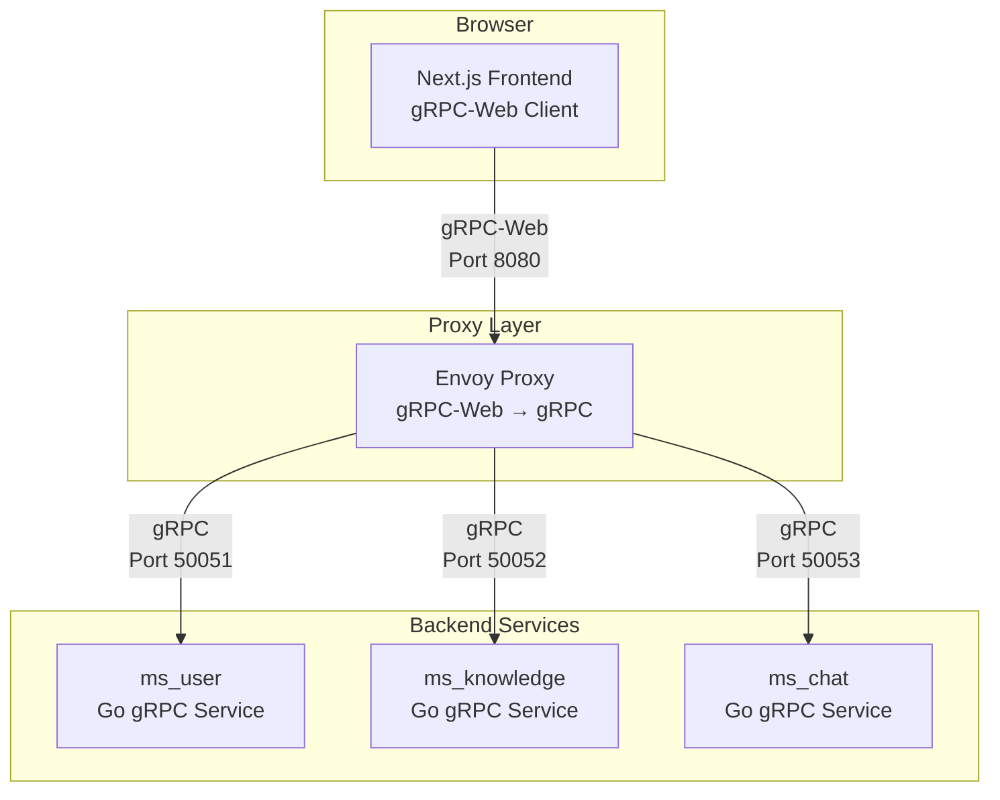

# gRPC-Web Implementation Guide

**Document Version:** 1.0  
**Last Updated:** 2025-07-23  
**Target Audience:** Developers, DevOps Engineers, System Architects

## Table of Contents

1. [Overview](#overview)
2. [Architecture Components](#architecture-components)
3. [Protocol Buffer Definitions](#protocol-buffer-definitions)
4. [Backend Implementation (Go)](#backend-implementation-go)
5. [Frontend Implementation (Next.js)](#frontend-implementation-nextjs)
6. [gRPC-Web Proxy Setup](#grpc-web-proxy-setup)
7. [Authentication & Authorization](#authentication--authorization)
8. [Development Workflow](#development-workflow)
9. [Deployment Configuration](#deployment-configuration)
10. [Troubleshooting](#troubleshooting)
11. [Performance Considerations](#performance-considerations)

## Overview

This guide documents the complete implementation of gRPC-Web communication in our Hierarchical Text Visualization system. Our architecture uses gRPC-Web for all frontend-backend communication, providing type-safe, high-performance binary protocol communication with end-to-end code generation.

### Why gRPC-Web?

**Advantages over REST API:**
- **Type Safety**: Protocol Buffer definitions ensure compile-time type checking
- **Performance**: Binary protocol with HTTP/2 multiplexing
- **Code Generation**: Automatic client/server stub generation
- **Streaming Support**: Native support for streaming operations
- **Schema Evolution**: Backward-compatible API versioning
- **Developer Experience**: Better debugging with typed contracts

### Communication Flow

**Default (Request-Response):**
```
Browser Frontend (Server Action) → Next.js Server → Backend Services (gRPC)
```

**Real-time Streaming (One-Way):**
```
Browser Frontend (gRPC-Web Client) → Envoy Proxy → Backend Services (gRPC)
```

## Architecture Components

### Component Overview



### Key Technologies

**Frontend Stack:**
- Next.js 15 with App Router
- TypeScript for type safety
- Generated gRPC-Web client code
- Clerk for authentication

**Backend Stack:**
- Go microservices with gRPC
- Protocol Buffer definitions
- Clerk JWT verification
- PostgreSQL databases

**Proxy Layer:**
- Envoy Proxy for gRPC-Web translation
- CORS configuration for browser compatibility
- Authentication header forwarding

## Protocol Buffer Definitions

### Service Definition Example

**File: `api/proto/v1/user.proto`**

```protobuf
syntax = "proto3";

package user.v1;

import "google/protobuf/timestamp.proto";

option go_package = "demo/ms_user/api/proto/v1";

// UserService manages user accounts and preferences
service UserService {
  // Creates a new user during profile completion
  rpc CreateUser(CreateUserRequest) returns (CreateUserResponse);
  
  // Retrieves a user's profile
  rpc GetUser(GetUserRequest) returns (GetUserResponse);
  
  // Updates a user's profile information
  rpc UpdateUser(UpdateUserRequest) returns (UpdateUserResponse);
  
  // Checks if user needs profile completion
  rpc CheckUserStatus(CheckUserStatusRequest) returns (CheckUserStatusResponse);
  
  // Updates user preferences
  rpc UpdateUserPreferences(UpdateUserPreferencesRequest) returns (UpdateUserPreferencesResponse);
}

// User represents a user account in the system
message User {
  string id = 1;
  string clerk_user_id = 2;
  string email = 3;
  string full_name = 4;
  string username = 5;
  int64 storage_used_bytes = 6;
  int64 storage_quota_bytes = 7;
  string status = 8;
  google.protobuf.Timestamp created_at = 9;
  google.protobuf.Timestamp updated_at = 10;
  google.protobuf.Timestamp deleted_at = 11;
}

// Request messages
message CreateUserRequest {
  string clerk_user_id = 1;
  string email = 2;
  string full_name = 3;
  string username = 4;
}

message CheckUserStatusRequest {}

// Response messages
message CreateUserResponse {
  User user = 1;
}

message CheckUserStatusResponse {
  bool profile_completed = 1;
  bool needs_redirect = 2;
  string redirect_url = 3;
  User user = 4;
}
```

### Code Generation Commands

**Backend (Go):**
```bash
# In microservice directory (e.g., ms_user/)
protoc --go_out=. --go_opt=paths=source_relative \
       --go-grpc_out=. --go-grpc_opt=paths=source_relative \
       api/proto/v1/user.proto
```

**Frontend (TypeScript/JavaScript):**
```bash
# In frontend directory
protoc --js_out=import_style=commonjs:src/api/generated \
       --grpc-web_out=import_style=typescript,mode=grpcwebtext:src/api/generated \
       --proto_path=../ms_user/api/proto/v1 \
       ../ms_user/api/proto/v1/user.proto
```

## Backend Implementation (Go)

### gRPC Server Setup

**File: `internal/server/grpc.go`**

```go
package server

import (
    "context"
    userv1 "demo/ms_user/api/proto/v1"
    "demo/ms_user/internal/service"
)

type grpcServer struct {
    userv1.UnimplementedUserServiceServer
    userService *service.UserService
}

func NewGRPCServer(userService *service.UserService) userv1.UserServiceServer {
    return &grpcServer{userService: userService}
}

func (s *grpcServer) CheckUserStatus(ctx context.Context, req *userv1.CheckUserStatusRequest) (*userv1.CheckUserStatusResponse, error) {
    status, err := s.userService.CheckUserStatus(ctx)
    if err != nil {
        return nil, err
    }

    return &userv1.CheckUserStatusResponse{
        ProfileCompleted: status.ProfileCompleted,
        NeedsRedirect:    status.NeedsRedirect,
        RedirectUrl:      status.RedirectURL,
        User:             toUserPb(status.User),
    }, nil
}

func (s *grpcServer) CreateUser(ctx context.Context, req *userv1.CreateUserRequest) (*userv1.CreateUserResponse, error) {
    user, err := s.userService.CreateUser(ctx, req.ClerkUserId, req.Email, req.FullName, req.Username)
    if err != nil {
        return nil, err
    }
    return &userv1.CreateUserResponse{User: toUserPb(user)},
 nil
}

// Helper function to convert domain model to protobuf
func toUserPb(user *domain.User) *userv1.User {
    if user == nil {
        return nil
    }
    return &userv1.User{
        Id:                user.ID.String(),
        ClerkUserId:       user.ClerkUserID,
        Email:             user.Email,
        FullName:          user.FullName,
        Username:          user.Username,
        StorageUsedBytes:  user.StorageUsedBytes,
        StorageQuotaBytes: user.StorageQuotaBytes,
        Status:            user.Status,
        CreatedAt:         timestamppb.New(user.CreatedAt),
        UpdatedAt:         timestamppb.New(user.UpdatedAt),
    }
}
```

### Authentication Interceptor

**File: `internal/middleware/auth_interceptor.go`**

```go
package middleware

import (
    "context"
    "strings"
    
    "github.com/clerk/clerk-sdk-go/v2/client"
    "github.com/clerk/clerk-sdk-go/v2/jwt"
    "google.golang.org/grpc"
    "google.golang.org/grpc/codes"
    "google.golang.org/grpc/metadata"
    "google.golang.org/grpc/status"
)

type AuthInterceptor struct {
    clerkClient *client.Client
}

func NewAuthInterceptor(clerkClient *client.Client) *AuthInterceptor {
    return &AuthInterceptor{clerkClient: clerkClient}
}

func (i *AuthInterceptor) Unary() grpc.UnaryServerInterceptor {
    return func(
        ctx context.Context,
        req interface{},
        info *grpc.UnaryServerInfo,
        handler grpc.UnaryHandler,
    ) (interface{}, error) {
        md, ok := metadata.FromIncomingContext(ctx)
        if !ok {
            return nil, status.Errorf(codes.Unauthenticated, "metadata is not provided")
        }

        authHeader := md.Get("authorization")
        if len(authHeader) == 0 {
            return nil, status.Errorf(codes.Unauthenticated, "authorization token is not provided")
        }

        token := strings.TrimPrefix(authHeader[0], "Bearer ")
        claims, err := jwt.Verify(ctx, &jwt.VerifyParams{Token: token})
        if err != nil {
            return nil, status.Errorf(codes.Unauthenticated, "token verification failed: %v", err)
        }

        // Inject user ID into context
        ctx = context.WithValue(ctx, "user_id", claims.Subject)

        return handler(ctx, req)
    }
}
```

### Main Server Configuration

**File: `cmd/main.go`**

```go
func main() {
    // Configuration loading
    cfg, err := config.LoadForDevelopment()
    if err != nil {
        log.Fatalf("failed to load configuration: %v", err)
    }

    // Initialize services
    userService := service.NewUserService(userRepo)
    authInterceptor := middleware.NewAuthInterceptor(clerkClient)
    grpcServer := server.NewGRPCServer(userService)

    // Start gRPC server
    lis, err := net.Listen("tcp", ":"+cfg.GRPCServerPort)
    if err != nil {
        log.Fatalf("failed to listen: %v", err)
    }

    s := grpc.NewServer(grpc.UnaryInterceptor(authInterceptor.Unary()))
    userv1.RegisterUserServiceServer(s, grpcServer)

    log.Printf("gRPC server listening on port %s", cfg.GRPCServerPort)
    if err := s.Serve(lis); err != nil {
        log.Fatalf("failed to serve: %v", err)
    }
}
```

## Frontend Implementation (Next.js)

### gRPC-Web Client Setup

**File: `src/api/client/grpc-client.ts`**

```typescript
import { UserServiceClient } from '../generated/UserServiceClientPb';

const grpcServerUrl = process.env.NEXT_PUBLIC_MS_USER_GRPC_WEB_URL || 'http://localhost:8080';

export const userClient = new UserServiceClient(grpcServerUrl);
```

### User Status Check Implementation

**File: `src/lib/user-status.ts`**

```typescript
import { userClient } from '@/api/client/grpc-client';
import { CheckUserStatusRequest } from '@/api/generated/user_pb';
import { auth } from '@clerk/nextjs/server';

export interface UserStatusResult {
  profileCompleted: boolean;
  needsRedirect: boolean;
  redirectUrl: string;
  userExists: boolean;
}

export async function checkUserStatus(): Promise<UserStatusResult> {
  try {
    const { userId, getToken } = await auth();
    
    if (!userId) {
      return {
        profileCompleted: false,
        needsRedirect: true,
        redirectUrl: '/sign-in',
        userExists: false,
      };
    }

    // Get Clerk session token for authorization
    const token = await getToken();
    if (!token) {
      return {
        profileCompleted: false,
        needsRedirect: true,
        redirectUrl: '/profile-completion',
        userExists: false,
      };
    }

    const request = new CheckUserStatusRequest();
    const metadata = {
      'authorization': `Bearer ${token}`
    };
    
    const response = await userClient.checkUserStatus(request, metadata);

    return {
      profileCompleted: response.getProfileCompleted(),
      needsRedirect: response.getNeedsRedirect(),
      redirectUrl: response.getRedirectUrl(),
      userExists: response.getUser() !== undefined,
    };
  } catch (error) {
    console.error('Failed to check user status:', error);
    return {
      profileCompleted: false,
      needsRedirect: true,
      redirectUrl: '/profile-completion',
      userExists: false,
    };
  }
}
```

### Middleware Implementation

**File: `middleware.ts`**

```typescript
import { authMiddleware } from "@clerk/nextjs";
import { NextResponse } from "next/server";
import { checkUserStatus } from "@/lib/user-status";

export default authMiddleware({
  publicRoutes: ["/sign-in", "/sign-up"],
  signInUrl: "/sign-in",
  afterAuth: async (auth, req) => {
    const isAuthPage = ["/sign-in", "/sign-up"].includes(req.nextUrl.pathname);
    const isProfileCompletion = req.nextUrl.pathname === "/profile-completion";
    
    if (isAuthPage) {
      return NextResponse.next();
    }

    if (!auth.userId) {
      return NextResponse.redirect(new URL('/sign-in', req.url));
    }

    if (isProfileCompletion) {
      return NextResponse.next();
    }

    try {
      const userStatus = await checkUserStatus();
      
      if (userStatus.needsRedirect && userStatus.redirectUrl) {
        return NextResponse.redirect(new URL(userStatus.redirectUrl, req.url));
      }
    } catch (error) {
      console.error('Error checking user status in middleware:', error);
      return NextResponse.redirect(new URL('/profile-completion', req.url));
    }

    return NextResponse.next();
  },
});

export const config = {
  matcher: ["/((?!.*\\..*|_next).*)", "/(api|trpc)(.*)"],
};
```

### Server Actions with gRPC-Web

**File: `src/app/feature/auth/profile-completion/actions.ts`**

```typescript
'use server';

import { userClient } from '@/api/client/grpc-client';
import { CreateUserRequest, UpdateUserPreferencesRequest } from '@/api/generated/user_pb';
import { auth } from '@clerk/nextjs/server';
import { redirect } from 'next/navigation';

export async function completeUserProfileAction(formData: FormData) {
  const { userId, getToken } = await auth();
  if (!userId) {
    return { success: false, error: 'User not authenticated.' };
  }

  try {
    const token = await getToken();
    if (!token) {
      return redirect(`/profile-completion?error=no-token`);
    }

    const metadata = {
      'authorization': `Bearer ${token}`
    };

    // Create user in backend
    const createUserRequest = new CreateUserRequest();
    createUserRequest.setClerkUserId(userId);
    createUserRequest.setEmail(formData.get('email') as string);
    createUserRequest.setFullName(formData.get('fullName') as string);
    createUserRequest.setUsername(formData.get('username') as string);

    await userClient.createUser(createUserRequest, metadata);

    // Set up user preferences
    const preferencesRequest = new UpdateUserPreferencesRequest();
    preferencesRequest.setUserId(userId);
    preferencesRequest.setTheme(formData.get('theme') as string);
    preferencesRequest.setLanguage(formData.get('language') as string);
    preferencesRequest.setTimezone(formData.get('timezone') as string);

    await userClient.updateUserPreferences(preferencesRequest, metadata);
  } catch (error) {
    console.error('Failed to complete user profile:', error);
    return redirect(`/profile-completion?error=profile-completion-failed`);
  }

  redirect('/');
}
```

## gRPC-Web Proxy Setup

### Envoy Configuration

**File: `envoy.yaml`**

```yaml
admin:
  address:
    socket_address: { address: 0.0.0.0, port_value: 9901 }

static_resources:
  listeners:
  - name: listener_0
    address:
      socket_address: { address: 0.0.0.0, port_value: 8080 }
    filter_chains:
    - filters:
      - name: envoy.filters.network.http_connection_manager
        typed_config:
          "@type": type.googleapis.com/envoy.extensions.filters.network.http_connection_manager.v3.HttpConnectionManager
          codec_type: auto
          stat_prefix: ingress_http
          route_config:
            name: local_route
            virtual_hosts:
            - name: local_service
              domains: ["*"]
              routes:
              - match:
                  prefix: "/"
                route:
                  cluster: ms_user_service
                  timeout: 0s
                  max_stream_duration:
                    grpc_timeout_header_max: 0s
              cors:
                allow_origin_string_match:
                - prefix: "*"
                allow_methods: GET, PUT, DELETE, POST, OPTIONS
                allow_headers: keep-alive,user-agent,cache-control,content-type,content-transfer-encoding,custom-header-1,x-accept-content-transfer-encoding,x-accept-response-streaming,x-user-agent,x-grpc-web,grpc-timeout,authorization
                max_age: "1728000"
                expose_headers: custom-header-1,grpc-status,grpc-message
          http_filters:
          - name: envoy.filters.http.grpc_web
            typed_config:
              "@type": type.googleapis.com/envoy.extensions.filters.http.grpc_web.v3.GrpcWeb
          - name: envoy.filters.http.cors
            typed_config:
              "@type": type.googleapis.com/envoy.extensions.filters.http.cors.v3.Cors
          - name: envoy.filters.http.router
            typed_config:
              "@type": type.googleapis.com/envoy.extensions.filters.http.router.v3.Router

  clusters:
  - name: ms_user_service
    connect_timeout: 0.25s
    type: logical_dns
    http2_protocol_options: {}
    lb_policy: round_robin
    load_assignment:
      cluster_name: ms_user_service
      endpoints:
      - lb_endpoints:
        - endpoint:
            address:
              socket_address:
                address: localhost
                port_value: 50051
```

### Running Envoy Proxy

**Development:**
```bash
docker run --rm -p 8080:8080 -p 9901:9901 \
  -v $(pwd)/envoy.yaml:/etc/envoy/envoy.yaml:ro \
  envoyproxy/envoy:v1.28-latest \
  /usr/local/bin/envoy -c /etc/envoy/envoy.yaml
```

## Authentication & Authorization

### Token Flow

1. **Frontend**: User signs in with Clerk
2. **Frontend**: Obtains session token via `getToken()`
3. **Frontend**: Includes token in gRPC-Web metadata: `{'authorization': 'Bearer <token>'}`
4. **Envoy**: Forwards authorization header to backend
5. **Backend**: Validates JWT with Clerk SDK
6. **Backend**: Extracts user ID and adds to request context

### Error Handling

```typescript
// Frontend error handling
try {
  const response = await userClient.checkUserStatus(request, metadata);
  // Handle successful response
} catch (error) {
  if (error.code === grpc.StatusCode.UNAUTHENTICATED) {
    // Redirect to sign-in
    redirect('/sign-in');
  } else if (error.code === grpc.StatusCode.NOT_FOUND) {
    // User needs profile completion
    redirect('/profile-completion');
  } else {
    // Handle other errors
    console.error('gRPC error:', error);
  }
}
```

## Development Workflow

### 1. Protocol Buffer Development

1. **Define Service**: Update `.proto` files with new methods
2. **Generate Code**: Run protoc commands for both frontend and backend
3. **Implement Backend**: Add service methods in Go
4. **Implement Frontend**: Use generated client code
5. **Test Integration**: Test end-to-end communication

### 2. Local Development Setup

**Terminal 1 - Backend:**
```bash
cd ms_user
go run cmd/main.go
# Server runs on port 50051
```

**Terminal 2 - Envoy Proxy:**
```bash
docker run --rm -p 8080:8080 \
  -v $(pwd)/envoy.yaml:/etc/envoy/envoy.yaml:ro \
  envoyproxy/envoy:v1.28-latest
# Proxy runs on port 8080
```

**Terminal 3 - Frontend:**
```bash
cd frontend
npm run dev
# Frontend runs on port 3002
```

### 3. Testing gRPC-Web Connection

**Check Envoy Admin:**
```bash
curl http://localhost:9901/stats | grep ms_user
```

**Test Backend Connection:**
```bash
grpcurl -plaintext localhost:50051 list
```

## Deployment Configuration

### Docker Compose Setup

**File: `docker-compose.yml`**

```yaml
version: '3.8'

services:
  envoy:
    image: envoyproxy/envoy:v1.28-latest
    ports:
      - "8080:8080"  # gRPC-Web proxy
      - "9901:9901"  # Admin interface
    volumes:
      - ./envoy.yaml:/etc/envoy/envoy.yaml:ro
    depends_on:
      - ms_user
    networks:
      - app-network

  ms_user:
    build:
      context: ./ms_user
      dockerfile: Dockerfile
    ports:
      - "50051:50051"  # gRPC port
    environment:
      - CLERK_SECRET_KEY=${CLERK_SECRET_KEY}
      - CLERK_WEBHOOK_SECRET=${CLERK_WEBHOOK_SECRET}
      - DATABASE_URL=${DATABASE_URL}
    networks:
      - app-network

  frontend:
    build:
      context: ./frontend
      dockerfile: Dockerfile
    ports:
      - "3002:3000"
    environment:
      - NEXT_PUBLIC_MS_USER_GRPC_WEB_URL=http://localhost:8080
      - NEXT_PUBLIC_CLERK_PUBLISHABLE_KEY=${NEXT_PUBLIC_CLERK_PUBLISHABLE_KEY}
    depends_on:
      - envoy
    networks:
      - app-network

networks:
  app-network:
    driver: bridge
```

### Environment Variables

**Frontend (`.env.local`):**
```env
NEXT_PUBLIC_CLERK_PUBLISHABLE_KEY="pk_test_..."
NEXT_PUBLIC_MS_USER_GRPC_WEB_URL="http://localhost:8080"
```

**Backend (`.env.local`):**
```env
CLERK_SECRET_KEY="sk_test_..."
CLERK_WEBHOOK_SECRET="whsec_..."
DATABASE_URL="postgresql://..."
GRPC_PORT=50051
WEBHOOK_PORT=8081
```

## Troubleshooting

### Common Issues

**1. CORS Errors**
```
Access to fetch at 'http://localhost:8080/...' from origin 'http://localhost:3002' has been blocked by CORS policy
```
**Solution:** Check Envoy CORS configuration, ensure all required headers are allowed.

**2. Authentication Failures**
```
gRPC error: code = Unauthenticated desc = authorization token is not provided
```
**Solution:** Verify token is being passed in metadata, check Clerk token validity.

**3. Connection Refused**
```
gRPC error: code = Unavailable desc = failed to connect to all addresses
```
**Solution:** Ensure backend service is running, check Envoy cluster configuration.

### Debug Commands

**Check Envoy Configuration:**
```bash
curl http://localhost:9901/config_dump
```

**Check Backend Health:**
```bash
grpcurl -plaintext localhost:50051 grpc.health.v1.Health/Check
```

**Check gRPC-Web Connectivity:**
```bash
curl -X POST http://localhost:8080/user.v1.UserService/CheckUserStatus \
  -H "Content-Type: application/grpc-web+proto" \
  -H "Authorization: Bearer <token>"
```

## Performance Considerations

### Optimization Strategies

**1. Connection Pooling**
- Use singleton gRPC-Web clients
- Implement connection reuse across requests

**2. Caching**
- Cache user status checks with appropriate TTL
- Implement client-side response caching

**3. Compression**
- Enable gRPC compression in Envoy configuration
- Use appropriate message size limits

**4. Error Handling**
- Implement exponential backoff for retries
- Use circuit breaker patterns for resilience

### Monitoring

**Key Metrics to Track:**
- gRPC-Web request latency
- Error rates by status code
- Connection pool utilization
- Envoy proxy metrics

**Logging Configuration:**
```yaml
# In envoy.yaml
access_log:
- name: envoy.access_loggers.file
  typed_config:
    "@type": type.googleapis.com/envoy.extensions.access_loggers.file.v3.FileAccessLog
    path: "/dev/stdout"
    format: |
      [%START_TIME%] "%REQ(:METHOD)% %REQ(X-ENVOY-ORIGINAL-PATH?:PATH)% %PROTOCOL%"
      %RESPONSE_CODE% %RESPONSE_FLAGS% %BYTES_RECEIVED% %BYTES_SENT%
      %DURATION% %RESP(X-ENVOY-UPSTREAM-SERVICE-TIME)% "%REQ(X-FORWARDED-FOR)%"
      "%REQ(USER-AGENT)%" "%REQ(X-REQUEST-ID)%" "%REQ(:AUTHORITY)%" "%UPSTREAM_HOST%"
```

---

This guide provides a complete reference for implementing and maintaining gRPC-Web communication in our system. For questions or issues not covered here, please refer to the [gRPC-Web documentation](https://github.com/grpc/grpc-web) or consult the development team.