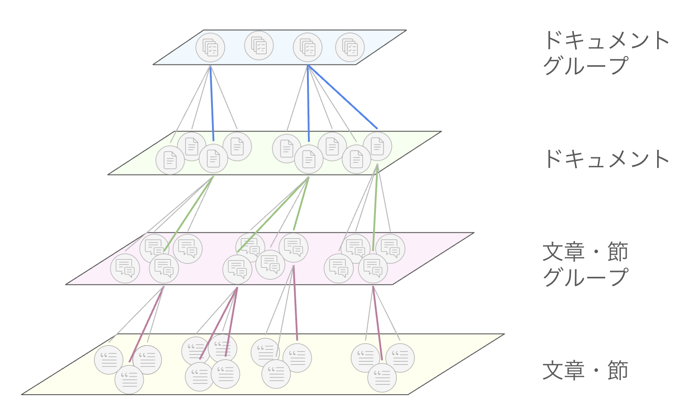

# プロジェクト概要

## 1. 概要：
本プロジェクトでは、大量のテキスト・ドキュメント情報を詳細度 (粒度；Granularity) 別に構造化し、異なる２/３次元空間にて視覚的に表現するソフトウェア開発を行います。図１では、多層２次元空間に構造化された情報のイメージを示しています。従来の線形的なテキストでは、縦あるいは横へと一方方向に流れてしまい、情報の構造化が困難です。仮に章や節ごとに階層化されていても、情報間の関連性や全体像を“直感的に”把握することは容易ではありません。一方で、テキストのベクトル化とクラスタリングによって情報の構造化が可能となったものの、情報の概要と詳細、あるいは抽象的・具体的な情報が同じ空間内にマッピングされているため、多くの情報が与えられすぎてしまいます。これによって、情報のオーバーロードや処理キャパシティを超えてしまうことが課題です。
提案するソフトウェアでは、これらの課題を解決するために、ベクトル化されたテキストデータを情報の粒度に応じて異なる空間に階層的に配置します。これにより、ユーザーは俯瞰的な視点から徐々に詳細な情報へと相互的にナビゲートでき、知識の効率的な探索と理解を可能とする新しい認知科学的なアプローチを提供します。さらに、AIによる情報の要約・分析により、膨大な情報から必要な領域の特定と知識の抽出を迅速に行うことが可能なプラットフォームを目指します。

図１：詳細度別に多層２次元空間に階層化されたテキスト情報の例。トップ層は大まかなカテゴリーに基づくドキュメントクラスターを形成し、ボトム層はオリジナルの文章情報を保存。検索実行時は、トップ層からの段階的なフィルタリングがユーザーに俯瞰的な情報を提供し、彼らが探し求める詳細情報までのナビゲーションをサポートする。

## 2. 提案するソフトウェアの紹介：
開発予定のソフトウェアでは、以下の主要機能を実装します：

### 2.1. データ取込・処理エンジン：
- 多様な形式のドキュメントを取り込み、Embeddingモデルによってテキストデータを高次元ベクトル空間にマッピング
- GoogleDriveとOneDriveなどの連携により、外部データベースからのドキュメントの取得を可能とする
- LLMによる抽象的なドキュメントサマリーを生成し、これを情報の“概要・抽象レイヤー”として、オリジナルの文章を“詳細・具体レイヤー”として扱う

### 2.2. 階層構造構築モジュール：
- 情報の粒度別に異なる高次元空間の生成【ドキュメントクラスタ=> ドキュメントサマリ=> 文章クラスタ=> 文章】
- 空間を下に移動するにつれて、抽象的な概念から具体的な内容へと移行し、段階的に情報の範囲を絞り込みながら詳細度を高める構造を目指す
- 次元削減アルゴリズムとクラスタリング手法の組み合わせによって、高次元データを2次元または3次元空間への圧縮により視覚化を行う
- コサイン類似度などの指標に基づき、異なる高次元空間同士 (ドキュメント<=>文章) の関連性分析と接続強度の計算を実施

### 2.3. インタラクティブ可視化インターフェース：
- 2次元または3次元空間における階層的データの動的可視化と、直感的な操作によるクラスター間の移動と探索
- 俯瞰的ビューからの段階的ズームインや、異なる情報粒度空間のシームレスなアクセスを実現
- カーソルのホバーリングによる関連キーワードの表示と、オリジナルのテキストデータへの即時アクセスを実現
- アップデートされた文章のスクロールに合わせて、現在のベクトル空間における位置情報を提示

### 2.4. 検索・クエリシステム：
- 自然言語クエリからの効率的なベクトル検索とドキュメント参照を提供 (NotebookLMと同等の機能)
- 検索結果の階層的表示によって、より俯瞰的な視点からの関係性の把握を推進
- 段階的な情報の絞り込み行い、ユーザーが求める情報へのアクセスための言語化とより適切な情報抽出のためのクエリをサポート

### 2.5. 主要機能のエクステンション
- Chrome Extentionより、Webページのテキスト情報を取得し、2D/3Dのビジュアルを即座に表示する機能
- スマホを通じてのアクセスを実現するため、指定のQRコードより2D/3DのビジュアルをA拡張現実（AR）で表示する機能

以下の機能は、プロジェクトの進み具合によりその都度スケーリングを行うつもりです。
### 2.6. 広告最適化と戦略的配置：
- 本ソフトウェアでは、関連する情報やドキュメント毎にクラスタリングが実施されるため、各ユーザーの興味や関心の取得がリアルタイムで可能。
- 広告の掲示時間は約5秒ほどに設定し、ベクトル検索とLLMの出力時間を待つ間に投入することを予定。Freemiumプラン加入者のみに限る。

### 2.7. 新しい学術的アプローチの探索：
- 一般的な次元削減技術、特にPCAなどでもある程度の結果 (２/３次元内でのセマンティックな情報構造) が得られると予測されますが、これらは事前にベクトル化されたドキュメント情報のみに基づく傾向。
- RAGパイプラインでは、情報抽出・検索時にユーザークエリもベクトル化されるため、そのクエリベクトルも考慮した次元削減手法の導入を検討。いわば、ユーザーの質問に基づいて、非線形的に多次元空間を切り取り、２/３次元へ圧縮する技術の開発を行う。

### 2.8. キャラクターデザイン：
- 階層的情報構造と知識探索などの観点から”世界樹=>ユグドラシル) ”という象徴が形成されるので、数々の神話に登場する神様からキャラクターをデザイン、VR/ARの世界を見据えて背景デザインにも取り組む。
- 知識探索に関連する機能として、複数AIエージェントによるディスカッション機能の実装も検討。各エージェントが神様を象徴とする魅力的なキャラクターであればエンターテイメント性の向上や、ソフトウェアとしての機能を超えたコンテンツ化にも期待。

### 2.9. プロジェクト終了後のアクション：
- AISaaSやAaaS (Agent as a Service) としてローンチし、保守・運用・アップデート
- 教育、学術などの特定分野、あるいは企業向けに特化したバージョンの開発
- スマートフォンからのアクセスを可能とするために、モバイル版アプリケーションの開発
- 階層的情報構造化、次元削減、モデルトレーニングに関する論文を執筆し、学術誌やジャーナルへ投稿
- 企業からのBuyoutオファーがあった場合、私自身もチームに加わることを条件に売却も検討。グローバルで活躍する日本企業ならなお良いが。

## 3. 差別化・導入例：
### 3.1. 他サービス・アプローチとの差別化
Facebookリサーチチームが開発した”FAISS”のInverted File Index (IVF) 手法では、ベクトルの量子化 (複数ベクトルの平均値の取得など) により階層的なツリー構造による情報検索が可能となりました。しかし、この階層化は、セマンティックな関連性のみに焦点が当てられ、情報の詳細度は考慮されていません。一方で、Hierarchical Navigation Small World (HNSW) 手法では、ベクトル量子化やクラスタリングが実装されず、ランダムに最上位の層 (Top Layer) が選択されます。ベクトル化されたテキスト情報との接続や関連性をナビゲートするような検索の手法を提供している点は参考となりますが、やはり”概要から詳細”というフローは未だ確立できていません。

次に、RAGを使った情報検索を提供するサービスの一つに、Google社が提供している“NotebookLM”があげられます。ここでは、NotebookLMの機能を比較し、本プロジェクトとの違いをまとめます：
- NotebookLMでは、ドキュメント数に比例して、検索時間が長くなる傾向あり。つまり、情報の事前処理 (クラスタリング等) なしに、すべてのベクトル情報を検索していると予測。本ソフトウェアの検索手法は、ツリー構造での検索が行わるため、処理速度をある程度一定に保つことが可能。例えば、ドキュメントサマリーとの関連性が著しく低いと判定されれば、そのドキュメントに属する文章との関連度検索を省略。
- NotebookLMでは、手動でドキュメントの絞り込みを行うため、不必要な情報が検索に利用される。また、ユーザー自身もどのドキュメントにどんな情報があるのかを直感的に理解することは不可能。本ソフトウェアでは、段階的なドキュメント絞り込みと俯瞰的な情報検索により、ユーザーが持つ真の要求やゴールに寄り添うことが可能。
- 本ソフトウェアは、情報の検索だけでなく構造化に着目している。つまり、検索を行うためには要求が言語化される必要がある。構造化によりその要求やアイデア自体を生み出すこともサポート。

最後に、上記は情報の“検索”のみに着目していましたが、本プロジェクトでは“情報の理解”や“情報の構造化”にも焦点を当てています。例えば、ユーザーがアップロードされた文章を読み進める際に、構造化されたダイアグラムが「特定の文章はどのカテゴリに属し、さらにどのグループに位置しているのか」をリアルタイムで表示する機能を提供する予定です 。さらに、ユーザーのクエリによって情報のフィルタリングが行われた後には、各ドキュメントや文章同士の関連性を視覚的に認識できるようになります。

### 3.2. 予測される導入例
- 学術的な研究者：様々な文献から関連文章や引用のピックアップ、各文献や研究内容のクラスタリングも可能として、構造化をサポート。
- 学生・学習者：情報の整理と構造化、情報の検索。教材や各自のノートを含む。
- SaaS間の仲介：複数のSaaSより取得された膨大なテキスト情報を構造化、それらを束ねるAIエージェントに対しての情報整理。
- ハードウェア：PC上に保存されたファイルを自動で構造化、ファイリングを実施。
- ビジネス：社内ドキュメントの自動ファイリングと可視化、Google DriveやOneDriveとの同期
- 金融マーケット関係者：リアルタイムで経済ニュースを分析し、構造化と視覚化を実施。特定の株価や指標に紐づけることで、データ主導のアクションをサポート。

