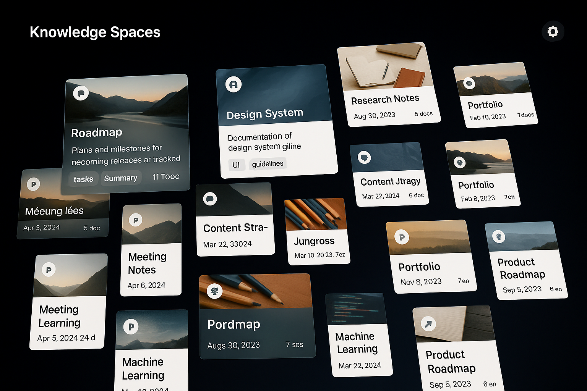
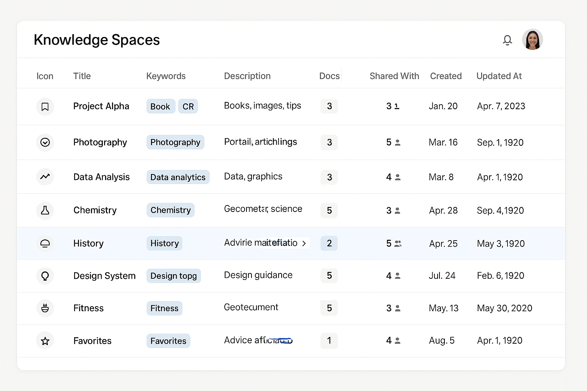
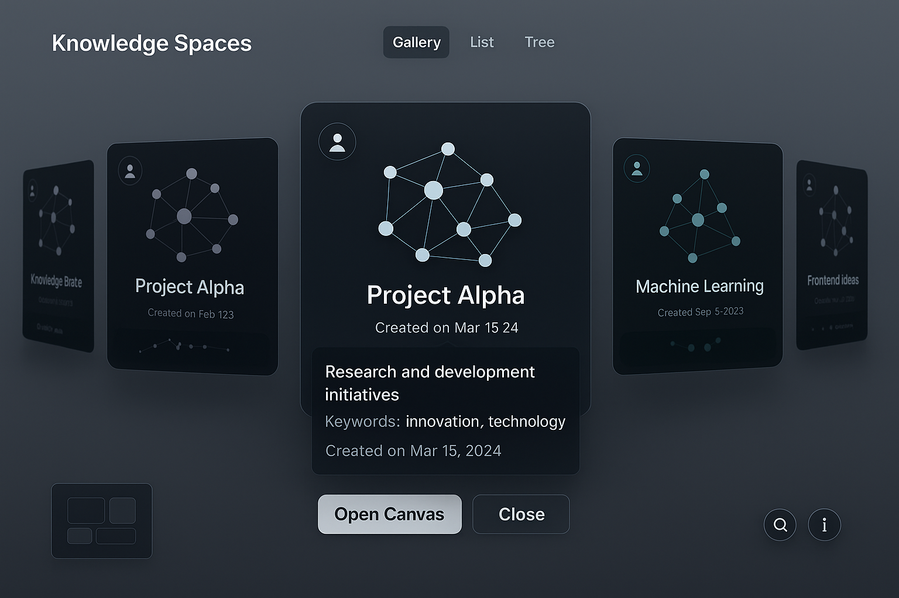
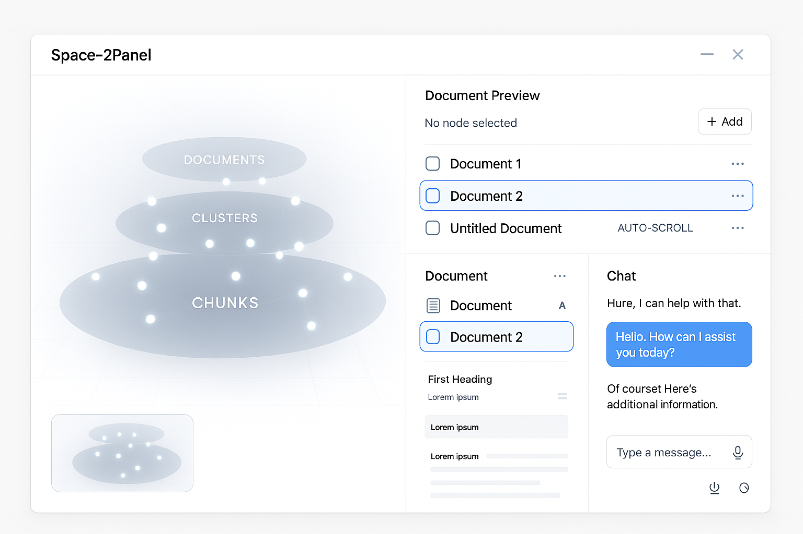

# Frontend Requirements

## Homepage (`/`) or Spaces (` spaces/ `)
- homepage after the user signed in and logged in 
- the collection of the knowledge spaces
- examples/references: homepage of the NotebookLM, Notion Database

### User Functinalities:
- Owner/Admin can create a new knowledge space, a collection of contents/documents. (Based on Owner's full control, Admin's management capabilities)
- Owner/Admin can delete a space from the setting button. (Only Owner has explicit permission to delete spaces)
- Owner/Admin can edit the title, image, description, and keywords of the space from the setting button. (Based on Owner/Admin's control) setting button.

### Visual Requirement:
1. Gallery view:
{ height=500px, width=800px }
    - The size of each space card can be changed to small, medium, large.
    - The created space displays the `icon`, `title`, `cover_image`, `created_at`, `document_count`; on hover, showing the descriptions and keywords.

2. List/Table view:
{ height=500px, width=800px }
    - The created space displays the following metadata; 
        - (individual) icon, title, keywords, description(?), num of document_count, created_at, updated_at, visibility
        - (team) icon, title, keywords, description(?), num of shared_with, document_count, created_at, updated_at
    - `icon`(upload), `title`(text), `description`(text), `keywords`(multi-select), `visibility`(select) can be directly editable by clicking each section.
    - if user click number of `shared_with`, the shared_with users list will be shown up; add new users from both spread sheet and manual way (idea).
    - if user click number of `document_count`, the document list will be shown up.
    - if user click the column names of `title`, num of `shared_with`, `document_count`, `created_at`, `updated_at`, do the sorting; make sure to show up the sign of ascending or descending.

3. Tree(Canvas) view:
{ height=500px, width=800px }
- **Purpose**: Provides a visual, interactive way to browse Spaces. Displays each Space as a card featuring a mini keyword-graph preview, arranged in a navigable carousel. Allows quick entry into any Space's full canvas.
- **Layout & Navigation**:
    - Features a central 3D circular carousel of Space cards on a full-area canvas background.
    - The front-most card is active (larger, fully opaque), while others recede visually (smaller scale, reduced opacity) to imply depth.
    - Rotate the carousel using horizontal mouse scroll, drag/swipe, or keyboard arrow keys (←/→).
- **Space Card**:
        - Displays an interactive mini-graph preview of the Space's keyword structure (hover pans slightly, scroll zooms).
    - Includes a title bar at the bottom.
    - On hover, reveals Space description, keywords (first few), and created_at date.
    - Single-click or Spacebar (␠) triggers a Quick Preview: a larger modal view of the card with full pan/zoom in the graph and "Open Canvas" / "Close" actions.
    - Double-click, Enter (⏎), or "Open Canvas" button navigates to the Space's dedicated full canvas view.
- **Mini-map**:
    - A small thumbnail overview of the carousel is shown (e.g., bottom-left).
    - Clicking on the mini-map jumps the carousel to the corresponding position.
- **Interactions & Editing**:
    - Right-click / long-press on a card opens a context menu (Rename, Change Icon, Delete, Duplicate).
    - Drag-and-drop one card onto another initiates a "Merge Spaces" confirmation.
    - Standard keyboard shortcuts (Esc, etc.) and accessibility features (ARIA roles, focus) are supported.
- **Responsive Behavior**:
    - The carousel layout adapts to different screen sizes, potentially simplifying to a horizontal list or single-card swipe view on smaller devices.

## Space Page (`spaces/{space_id}`)
{ height=500px, width=800px }
### User Functinalities:
- Owner/Admin can delete the space from the setting button. (Only Owner has explicit permission to delete spaces)
- Owner/Admin can edit the title, image, description, and keywords of the space from the setting button. (Based on Owner/Admin's control) setting button.
- Editors can upload and delete documents, use of chat session.
- Commenters can comment on canvas nodes and paths
- Viewers can view the canvas and document preview, also use chat session.
- Guest can view the canvas and document preview, but not use chat session.

### Visual/Action Requirement:
- Option (1): The screen is split to 2 parts: left is the 2d/3d tree visualization canvas, the right-side component is based on two parts; document preview (upper) and chat session (lower).
- Option (2): The screen is split to 3 parts, left is the 2d/3d tree visualization canvas, middle is the document preview, the right-side component is based on two parts; chat session.

#### (1) 2d/3d tree visualization on canvas:
- **Default Structure:** Displays a 2D/3D representation of a hierarchical 3-layer graph (e.g., Documents, Clusters, Chunks).
- **Hierarchy Preservation (Default View):** The vertical order of layers (Documents highest, Chunks lowest) must be strictly maintained at all times and must not invert. Imagine that its hierarchical 3-layer graph is an object; and its object is only turning based on yaw axis. Users cannot rotate the object in pitch and roll. 
- **Layer Representation:** 
    - Each layer is visually contained within its own semi-transparent elliptical plane. 
    - These planes are parallel and maintain their relative vertical positions.
    - Hovering the mouse cursor over an elliptical plane visually highlights that specific plane (e.g., increased border opacity, subtle fill color change) to indicate interactivity. Simultaneously, the documents layer metadata will be shown up.
- **Default View:** Initializes with a moderate top-down perspective (e.g., ~ -15° to -20° pitch relative to the horizon) showing all layers clearly.
- **Node:** 
    - Placement: Nodes belonging to a layer are positioned on that layer's elliptical plane.
    - Selection (Click - Applies in Both Views):
        - Triggers a smooth animation (using appropriate rotation - primarily Yaw in default view - and Zoom/Dolly) to center the selected node in the viewport.
        - Animation in the default view must not introduce Pitch or Roll changes.
- **Layer Isolation View**:
    - **Activation**: Clicking directly on an elliptical plane transitions the view smoothly to display only the nodes and intra-layer connections belonging to that selected layer (e.g., clicking the "Documents" ellipse shows only Document nodes). The other layers and their ellipses are hidden.
    - **Isolated Layout (Selectable 2D/3D)**: The layout of the nodes within this isolated view can be presented (or potentially toggled by the user) in either a flat 2D arrangement or a 3D spatial arrangement. (The default state and the specific mechanism for toggling 2D/3D need to be defined).
    - **Navigation (Isolated View)**: Standard navigation controls like Yaw rotation (horizontal drag) and Zoom remain functional, adapted for the single-layer context.
    - **Exiting Isolation**: A clear and easily accessible mechanism must be provided to return to the default 3-layer view (e.g., a dedicated "Show All Layers" button appearing in this mode, clicking the empty canvas background, an Escape key press).
- **Navigation (Default 3-Layer View)**:
    - Rotation (User Drag): User click-and-drag horizontally only performs Yaw rotation (around the vertical Z-axis). Pitch and Roll via drag are disabled.
    - Angle Adjustment (User Scroll): Mouse scrolling (when pointer is over this panel) adjusts the apparent viewing angle of the layers (making them look flatter or more edge-on) within a limited range that does not invert the hierarchy.
    - Zoom: Standard zoom (dolly) functionality is enabled (e.g., via scroll wheel).
    - Vertical Pan: Disabled.

#### (2) Document Preview:
- **Default View (No Node Selected)**: Displays a "Document List View".
    - Lists all uploaded documents vertically.
    - Each item shows: Title, Checkbox (Include/Exclude) for RAG/visualization scope, Overflow Menu (Delete option).
    - Provides an "Add" button for document uploads -> Show up **Document Upload Components**.
- **Active View (Node Selected)**: Displays a "Node Detail View".
    - Shows relevant content or metadata for the selected node (Document, Cluster, or Chunk).
    - If a node is selected, it simply auto-scrolling to the corresponding text section; Clicking Document Node -> the summary (top) section, Clicking Chunk Node -> the corresponding chunk section, Clicking Cluster Node -> the cluster (top) section.
    - Includes a mechanism (e.g., "Back" button) to return to the Document List View.
    - (Considering) node selection changes the canvas view to [**Textual Info Detail**](#textual-info-detail)

#### (3) Chat Session:
- **Core Functionality**: Provides an AI chat interface for users to interact with the RAG system by asking questions based on the included documents, or for general conversation.
- **Input Methods**:
    - Standard text input field.
    - "Voice Input" button/icon enabling users to dictate their queries.
- **Output Display Modes**:
    1. **Standard Mode (Default)**:
        - AI responses are displayed as text within the chat panel using streaming output (text appears progressively, word-by-word or chunk-by-chunk).
        - The content view automatically scrolls down to keep the latest message visible.
    2. **Annotation Mode (Optional)**:
        - (Mechanism for activation needs definition - e.g., user toggle, specific prompt instructions).
        - The response in the chat panel is short, structured, and acts as a summary or index to annotations placed elsewhere.
        - Parts of the AI's findings/explanations are visualized directly as annotations (e.g., speech bubbles, comments) on the Canvas (associated with relevant nodes) and/or the Document Preview (associated with relevant text chunks).
- **Message-Level Interactions (Applicable to both User Queries & AI Responses where appropriate)**:
    - Standard Actions: Each message bubble/area should offer actions (e.g., via hover menu or context menu) such as:
        - Edit: Modify the text of a user query (before re-execution) or potentially annotate/correct an AI response.
        - Delete: Remove the message (and potentially its paired response/query) from the chat history.
        - Re-execute: Rerun a specific user query.
        - Branch: Start a new conversational thread diverging from this point in the history.
        - Copy Text: Copy the message content to the clipboard.
    - Context Linking (On Click):
        - Clicking on a specific message bubble (either a user query or its corresponding AI response) triggers highlighting of the associated context used/retrieved during that conversational turn.
        - Canvas Integration: Relevant nodes (Documents, Clusters, Chunks) on the Left Canvas are visually highlighted.
        - Document Preview Integration: Relevant text chunks within the Right-Upper Panel are visually highlighted when the corresponding document is displayed.
        - (Assumption: Each query-response pair internally stores the IDs of the documents, clusters, and chunks involved in its generation to enable this linking.)
- **Context Highlighting (During/After Generation)**:
    - Canvas Integration: Nodes on the Canvas (2D/3D visualization) that correspond to the documents/clusters/chunks used as retrieved context for the generated response are visually highlighted.
    - Document Preview Integration: Specific text chunks within the Document Preview that were used as retrieved context are visually highlighted (e.g., background color change) when that document is displayed.
- **Retrieval Transparency ("Thinking/Retrieval Process")**:
    - Each AI response includes an optional, initially hidden section (e.g., implemented as an accordion or expandable element).
    - When expanded by the user (e.g., by clicking), this section reveals details about the retrieval process used to generate the response (e.g., list of retrieved chunks/documents, relevance scores, potentially intermediate reasoning steps).
- **Git-style Chat Flow Visualization**
    1. Activation & Location:
        - Implemented as a toggleable "Flow View" mode accessible within the main Right-Lower Chat Panel, alternating with the standard chronological message list view.
    2. Visualization Layout & Style:
        - Presents the chat history as an interactive diagram/graph, similar to Miro boards or Git visualizers.
        - Linear sequences of query-response pairs flow vertically downwards by default.
        - When a branch is created (via "+", edit, etc.), the new branch initially appears side-by-side with the original branch point.
        - Users can manually reposition individual chat boxes within the flow view canvas for custom layout organization.
        - Standard pan (click-drag background) and zoom (scroll wheel) controls are provided for navigating the flow view canvas.
    3. Chat Box Component Details:
        - Each box represents a single query-response pair.
        - Content:
            - Displays truncated text for both the User Query and the AI Answer.
            - Includes a "more" button or similar mechanism within each box to expand and view the full text content.
            - Features a "+" button at the bottom of each box to initiate a new branch from that specific point in the conversation.
            - Provides access to Edit/Delete actions (e.g., via a context menu or hover icons).
        - Metadata: Each box clearly displays its Timestamp and a Sequence Number/ID.
        - (Recommendation: Use subtle visual differentiation (e.g., background color, icons) to distinguish the user query part from the AI answer part within the box).
    4. Interactions & Logic:
        - Clicking a Box:
            - Highlights the associated context (nodes on Canvas, chunks in Document Preview).
            - Scrolls the standard chat view (if visible/toggled) to the corresponding message pair.
        - Clicking "+":
            - Activates the main chat input field.
            - The next submitted query creates a new chat box visually branching off from the box where "+" was clicked.
            - The standard chat view also follows this new active branch.
        - Deleting a Box:
            - Prompts the user with a confirmation panel.
            - Upon confirmation, removes the selected box AND all its descendant boxes/branches originating from it.
        - Editing User Query:
            - Always triggers a new AI generation based on the edited query text.
            - If the edited box (let's call it B, with parent A and child C: A -> B -> C) has existing children (C):
                - The original branch (A -> B -> C) remains untouched visually.
                - A new box (B_edited) is created, branching off from the parent of the edited box (A), resulting in: A -> B -> C AND A -> B_edited.
            - If the edited box has no children, it simply triggers regeneration and updates the answer in that box's branch. (Self-correction: Based on the logic for boxes with children, it's more consistent to always create a new branch upon editing a past query: A -> B, edit B => A -> B AND A -> B_edited). Let's adopt this: Editing a user query always creates a new branch from its parent.
        - Editing AI Answer:
            - Allows users to directly modify the text of a generated AI answer within a box.
            - Crucially: This revision must be registered by the system and potentially used to influence or improve future chat generations (acting as a form of explicit feedback or correction for the RAG system). The exact mechanism for incorporating this feedback needs further definition based on the RAG system's capabilities.
    5. Backend Processing:
        - The backend (specified as Go-based) must support concurrent execution of AI generation requests when multiple branches are explored or generated simultaneously.
    6. Complexity Management:
        - Implement functionality to collapse/expand entire branches to simplify complex views.
        - Provide an option or default behavior to highlight the K most recent chat boxes and their direct parent lineage, fading out older or less relevant branches.

## Other Components

### Document Upload Interface
1.  **Access Point:**
    - The interface for adding new sources is triggered by clicking the **"Add Docs" button** located within the **Right-Upper Panel** when it's in the default **"Document List View"**.
    - The interface appears as a **Modal Dialog**, overlaying the main application window.

2.  **Modal Interface Layout & Content:**
    - **Title:** Clearly labeled (e.g., "Add Documents").
    - **Informational Text:** Briefly explains the purpose (e.g., "Add document sources for the AI to use in its responses.").
    - **Main Upload Area:**
        -  A designated zone for **Drag & Drop** file uploads.
        -  A **"Choose File" button** for standard file browser selection.
        -  Lists **supported direct file types:** PDF, .txt, Markdown, Audio (.mp3), Video (.mp4).
    - **Cloud Storage Integration:**
        -  Dedicated sections or buttons for connecting to:
            -  **Google Drive:** (Likely requires OAuth) Allows selecting Docs, Slides, potentially other text-based formats.
            -  **OneDrive:** (Likely requires OAuth) Allows selecting relevant document formats.
            -  **Notion:** (Likely requires OAuth/API Key) Allows selecting specific Notion Pages or Databases for import.
    - **Web & Link Integration:**
        -  A section for adding sources via links:
            -  **Website URL:** Input field for website links.
            -  **YouTube URL:** Input field for YouTube video links.
    - **Text Input:**
        -  An option to **Paste Text** directly into a text area.
        -  Potentially a button to import **Copied Text** directly from the clipboard (as shown in the reference).
    - **Source Limit Display:**
        -  Visually displays the **current number of sources** added versus the **total limit**. (e.g., "13 / 30 Sources").
        -  Uses a progress bar or similar visual indicator.
        -  The limit is set to **30 sources** for the default/free user tier (under consideration).
    - **Action Buttons:** Includes buttons like "Close" or "Done".

3.  **Backend Processing & Handling:**
    - **Direct File Uploads (PDF, TXT, MD):** Files are uploaded, text is extracted and stored.
    - **Audio (.mp3) / Video (.mp4) Uploads:**
        - Files are uploaded.
        - Backend system **automatically extracts the audio transcript/script** using speech-to-text technology.
        - The **extracted text** is stored and indexed for use by the RAG system. The original media file might be stored for reference but is not directly queried.
    - **YouTube Links:**
        - Backend system uses the **YouTube API** (or similar service) to fetch the video's **transcript**.
        - The **extracted text transcript** is stored and indexed.
    - **Website Links:**
        - Backend system fetches the website content, parses the main text body (stripping boilerplate/ads), and stores the **extracted text**.
    - **Cloud Storage:** Handled via API integrations after user authentication; relevant text content is fetched and stored.
    - **Pasted/Copied Text:** Stored directly as a text source.
    - **Feedback:** The UI should provide visual feedback during the upload and processing stages (e.g., progress bars per source, success/error indicators). Appropriate error handling for failed uploads, transcriptions, or unsupported formats must be implemented.

4.  **Outcome:**
    - Successfully added sources (after processing/text extraction) appear in the **Document List View** in the Right-Upper Panel and become available for inclusion in the RAG system and visualization on the Left Canvas.

### Web Search Section
1.  **Access Point & Interface Type:**
    - Accessed via a button, labeled **"Search Sources"**, located within the **Right-Upper Panel** when it's in the default **"Document List View"**.

2.  **UI Layout & Components (within the Modal):**
    - **Title:** Clearly labeled (e.g., "Web Search").
    - **Central Icon/Graphic:** A relevant icon (like the magnifying glass/exploration icon in the reference).
    - **Prompt Text:** A guiding question (e.g., "What are you interested in?").
    - **Query Input Area:**
        - A prominent multi-line text area for users to type their search topic or question.
        - Includes placeholder text (e.g., "Describe something you'd like to search about...").
    - **Search Mode Toggle:**
        - A clearly visible **toggle switch** or radio buttons allowing users to select between:
            - **Normal Search (Default):** Executes the user's query directly to find relevant web sources.
            - **Deep Search:** Executes the user's query, then uses AI to generate expanded/refined/step-by-step queries, executing those as well to find a more comprehensive set of sources.
    - **Action Buttons:**
        - **"Refine" Button:**
            - When clicked, uses AI to rephrase the current text in the Query Input Area to be potentially more informative or clearer for searching.
            - The rephrased query replaces the text in the input area, but the area **remains editable** by the user.
        - **"Voice Input" Button:** An icon/button that activates microphone input, allowing users to dictate their query into the input area.
        - **"Submit" / "Search" Button:** Initiates the search process using the current query text and the selected search mode (Normal/Deep).
    - **Close Button:** Standard modal close ('X') button.

3.  **Functionality & Workflow:**
    - User enters a topic/question into the Query Input Area (via typing or voice).
    - User selects the desired search mode (Normal or Deep) using the toggle.
    - User can optionally click "Refine" to improve their query (and potentially edit further).
    - User clicks "Submit".
    - A **progress bar** or loading indicator is displayed prominently within the modal, indicating that the search is in progress. This applies to *both* Normal and Deep Search modes.
    - The backend performs the search according to the selected mode.
    - **Outcome:** Upon completion, the modal should present the discovered web sources (e.g., as a list of URLs/titles/snippets). The user should then be able to select which of these discovered sources they want to **add** to their main source list in the application (likely closing the search modal and updating the "Add Sources" list or the main Document List View).

4.  **Backend Considerations:**
    - Requires integration with a web search API (e.g., Google Search API, Bing Search API, Brave Search API, etc.).
    - Requires an AI model (LLM) integration for the "Refine" functionality and for the query expansion/refinement steps in "Deep Search".
    - Needs logic to handle the different processing paths for Normal vs. Deep Search. Deep Search will involve multiple sequential or parallel search API calls based on the generated sub-queries.
    - Needs robust handling of search results (parsing, filtering duplicates if aggregating from sub-queries, extracting relevant metadata like title/URL/snippet).

### Textual Info Detail 
- showing each child components of each layer.
- 2D mindmap style; check the link (0:55) for the visual idea -> https://youtu.be/DTe6zF8U-XA?si=uWkPl0qFCy0B0W10&t=55

#### Document Detail
- centering a selected document with surrouding chunk clusters

#### Cluster Detail
- centering a selected cluster with surrouding chunks

#### Chunk Detail
- centering a selected chunk with surrounding related chunks