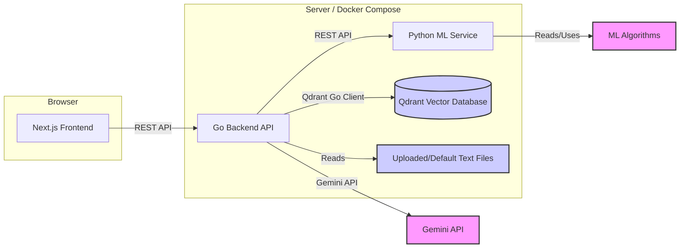

# System Architecture: Hierarchical Text Visualization Demo

This document outlines the system architecture for the Hierarchical Text Visualization demo, based on the defined requirements.

## 1. Overview

The system consists of three main components:
1.  **Frontend:** A Next.js application responsible for user interaction, data visualization, and communication with the backend.
2.  **Backend (Go):** A Go service acting as the main API gateway, orchestrating file processing, managing metadata, interacting with the vector store (Qdrant), and communicating with the Python ML service.
3.  **ML Service (Python):** A Python service (using Flask/FastAPI) responsible for computationally intensive ML tasks: text embedding, summarization, dimensionality reduction, and clustering.



## 2. Data Storage
With the introduction of Qdrant and Gemini API, the data storage strategy is updated as follows:
1. **Uploaded/Default Text Files:** 
   - Original .txt and .md files will be stored in the frontend's `data/` directory for default files.
   - Uploaded files are temporarily stored in memory and not persisted between sessions.
   
2. **Vector Embeddings & Search:** 
   - All vector embeddings (text chunks, potentially summaries) will be stored, indexed, and searched using a dedicated Qdrant service instance. 
   - The Go backend will interact with Qdrant via its official Go client.
   - Vector embeddings will be generated using Gemini API, called directly from the Go backend.
   
3. **Metadata:** 
   - Information linking documents, chunks, summaries, coordinates, and cluster assignments will be stored within the payload of the vectors in Qdrant. 
   - Document summaries and overall structure will be stored in Qdrant with appropriate metadata.


**Example Metadata Structure (Conceptual):**

**(A) Document-Level Information (Potentially stored in a separate JSON file or Qdrant collection):**

```json
// Example: Stored in documents.json or a dedicated Qdrant collection
[
  {
    "documentId": "doc_1", // Unique ID for the document
    "fileName": "example1.txt",
    "summaryText": "This is a summary of example1.",
    // Summary embedding could be stored here if needed, or as a point in Qdrant
    "summaryPosition": [x_doc, y_doc, z_doc], // Position for the summary node in visualization
    "summaryClusterId": "cluster_A", // Cluster assignment for the summary node
    "chunkIds": ["chunk_1_1", "chunk_1_2", ...] // List of associated chunk IDs
  }
  // ... more documents
]
```

**(B) Chunk-Level Information (Stored as points in Qdrant):**

**(Conceptual Qdrant Point Structure)**

```json
// Stored within Qdrant chunk collection
{
  "id": "vector_id_chunk_1_1", // Qdrant point ID (e.g., maps to chunkId or is chunkId)
  "vector": [0.3, 0.4, ...],   // Embedding of the chunk text
  "payload": {
    "documentId": "doc_1",      // Link back to the parent document
    "chunkId": "chunk_1_1",     // Internal ID for the chunk
    "text": "This is the first paragraph.",
    "position": [x1, y1, z1],   // Position for the chunk node (calculated by ML service)
    "clusterId": "cluster_A"   // Cluster assignment for the chunk node
  }
}
```
*(Note: This shows separate handling. Document metadata (A) provides overall info and links to chunks. Chunk data (B) is stored in Qdrant with embeddings and includes a link back to the parent document. How document data is persisted (JSON vs. separate Qdrant collection) is an implementation detail.)*

## 3. Folder Structures

### 3.1 Frontend (Next.js - App Router)

frontend/
├── app/                  # Next.js App Router directory
│   ├── api/              # API route handlers (if needed for server actions)
│   │   ├── page.tsx        # Main visualization page component
│   │   └── layout.tsx      # Layout for the visualization section
│   ├── layout.tsx        # Root layout
│   └── globals.css       # Global styles
├── components/           # Reusable React components
│   ├── ui/               # General UI elements (buttons, inputs etc. - shadcn/ui potentially)
│   ├── visualization/    # Visualization specific components
│   │   ├── ForceGraph3D.tsx # Wrapper for react-force-graph-3d
│   │   ├── NodeDetailsPanel.tsx # Panel to show node content
│   │   └── SearchBar.tsx      # Search input component
│   └── FileUpload.tsx      # Component for uploading files
├── hooks/                # Custom React hooks (e.g., useGraphData, useApi)
├── lib/                  # Utility functions, API client setup
│   ├── api.ts            # Functions for calling the Go backend API
│   └── utils.ts          # General utility functions
├── public/               # Static assets (images, etc.)
├── styles/               # Styling files (if not using CSS-in-JS or Tailwind extensively)
├── data/                 # Default sample text data for demo
├── next.config.js        # Next.js configuration
├── tsconfig.json         # TypeScript configuration
├── package.json          # Project dependencies
└── Dockerfile            # Dockerfile for building the frontend image

### 3.2 Backend (Go)

backend-go/
├── cmd/
│   └── server/           # Main application entry point
│       └── main.go
├── internal/             # Internal application code (not importable by others)
│   ├── api/              # API handlers (e.g., Gin, Echo)
│   │   ├── handlers.go   # Request handlers
│   │   └── router.go     # API route definitions
│   ├── config/           # Configuration loading (env vars, files)
│   │   └── config.go
│   ├── core/             # Core business logic
│   │   ├── document.go   # Structs/logic for documents, chunks, summaries
│   │   ├── processing.go # Orchestration logic (calling Python, Qdrant)
│   │   └── gemini.go     # Gemini API client and embedding/summarization logic
│   ├── ml/               # Client for communicating with Python ML Service
│   │   └── client.go
│   ├── storage/          # Data persistence logic (Vector DB interaction)
│   │   └── qdrant.go     # Client logic for interacting with Qdrant
│   └── utils/            # Utility functions specific to backend
├── pkg/                  # Shared libraries (if any, less common with `internal`)
├── data/                 # Persistent storage mount point (e.g., for uploaded files) - Managed by Docker Volume
├── scripts/              # Helper scripts (build, run, etc.)
├── go.mod                # Go module definition
├── go.sum                # Go module checksums
└── Dockerfile            # Dockerfile for building the Go backend image

### 3.3 ML Service (Python - Flask/FastAPI)


backend-py/
├── app/                  # Main application source code
│   ├── api/              # API endpoint definitions
│   │   └── routes.py
│   ├── services/         # Core ML service logic
│   │   ├── reduction_service.py   # Dimensionality reduction (UMAP with n_neighbors=15)
│   │   └── clustering_service.py  # Clustering (GMM or HDBSCAN)
│   ├── utils/            # Utility functions
│   └── main.py           # FastAPI/Flask app initialization and entry point
├── data/                 # Potential location for downloaded models (or use cache dir)
├── requirements.txt      # Python dependencies
└── Dockerfile            # Dockerfile for building the Python ML service image

## 4. Inter-service Communication

*   **Frontend -> Go Backend:** REST API (HTTP requests). The frontend sends requests for data, initiates processing, and performs searches.
*   **Go Backend -> Python ML Service:** REST API (HTTP requests) for dimensionality reduction and clustering operations only.
*   **Go Backend -> Gemini API:** Direct API calls for embedding generation and document summarization.
*   **Go Backend -> Qdrant:** Direct interaction using Qdrant's Go client for vector storage and search.

## 5. Containerization

*   A `docker-compose.yml` file at the root of the project will define the four services (frontend, backend-go, backend-py, qdrant) and manage networking.
*  Docker volumes will be used to persist data for Qdrant and potentially the uploaded files directory used by the Go backend.
