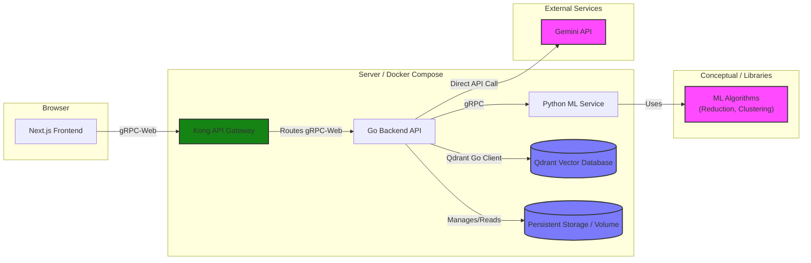

# System Architecture: Hierarchical Text Visualization Demo

This document outlines the system architecture for the Hierarchical Text Visualization demo, based on the defined requirements.

## 1. Overview

The system consists of three main components:
1.  **Frontend:** A Next.js application responsible for user interaction, data visualization, and communication with the backend.
2.  **Backend (Go):** A Go service acting as the main API gateway, orchestrating file processing, managing metadata, interacting with the vector store (Qdrant), and communicating with the Python ML service.
3.  **ML Service (Python):** A Python service (using gRPC or Flask/FastAPI) responsible for computationally intensive ML tasks: text embedding, summarization, dimensionality reduction, and clustering.



## 2. Data Storage
With the introduction of Qdrant and Gemini API, the data storage strategy is updated as follows:
1. **Uploaded/Default Text Files:** 
   - Original .txt and .md files will be stored in the frontend's `data/` directory for default files.
   - Uploaded files are temporarily stored in memory and not persisted between sessions.
   
2. **Vector Embeddings & Search:** 
   - All vector embeddings (text chunks, potentially summaries) will be stored, indexed, and searched using a dedicated Qdrant service instance. 
   - The Go backend will interact with Qdrant via its official Go client.
   - Vector embeddings will be generated using Gemini API, called directly from the Go backend.
   
3. **Metadata:** 
   - Information linking documents, chunks, summaries, coordinates, and cluster assignments will be stored within the payload of the vectors in Qdrant. 
   - Document summaries and overall structure will be stored in Qdrant with appropriate metadata.


**Example Metadata Structure (Conceptual):**

**(A) Document-Level Information (Potentially stored in a separate JSON file or Qdrant collection):**

```
// Example: Stored in documents.json or a dedicated Qdrant collection
[
  {
    "documentId": "doc_1", // Unique ID for the document
    "fileName": "example1.txt",
    "summaryText": "This is a summary of example1.",
    // Summary embedding could be stored here if needed, or as a point in Qdrant
    "summaryPosition": [x_doc, y_doc, z_doc], // Position for the summary node in visualization
    "summaryClusterId": "cluster_A", // Cluster assignment for the summary node
    "chunkIds": ["chunk_1_1", "chunk_1_2", ...] // List of associated chunk IDs
  }
  // ... more documents
]
```

**(B) Chunk-Level Information (Stored as points in Qdrant):**

**(Conceptual Qdrant Point Structure)**

```
// Stored within Qdrant chunk collection
{
  "id": "vector_id_chunk_1_1", // Qdrant point ID (e.g., maps to chunkId or is chunkId)
  "vector": [0.3, 0.4, ...],   // Embedding of the chunk text
  "payload": {
    "documentId": "doc_1",      // Link back to the parent document
    "chunkId": "chunk_1_1",     // Internal ID for the chunk
    "text": "This is the first paragraph.",
    "position": [x1, y1, z1],   // Position for the chunk node (calculated by ML service)
    "clusterId": "cluster_A"   // Cluster assignment for the chunk node
  }
}
```
*(Note: This shows separate handling. Document metadata (A) provides overall info and links to chunks. Chunk data (B) is stored in Qdrant with embeddings and includes a link back to the parent document. How document data is persisted (JSON vs. separate Qdrant collection) is an implementation detail.)*

## 3. Folder Structures

### 3.1 Frontend (Next.js)

```text
frontend/
└── src/
    ├── api/
    │   ├── generated/         # Universal TS code from .proto files
    │   ├── actions/           # All Server Actions
    │   │   └── canvasActions.ts
    │   ├── client.ts          # Exports CLIENT-side factories (gRPC-web, WS)
    │   └── server-client.ts   # Exports SERVER-side gRPC client singleton
    ├── app/                   # Next.js App Router (Pages & Layouts)
    ├── components/            # Reusable UI Components
    ├── features/              # Components & logic for specific features
    └── hooks/                 # Custom React Hooks (Client-side)
```

### 3.2 Backend (Go Microservice)

```text
/go-service/  
├── api/proto/v1/        # Protocol buffer definitions  
├── cmd/server/          # Application entry point  
├── ent/                 # Ent ORM schema and generated code  
├── internal/  
│   ├── config/          # Configuration management  
│   ├── domain/          # Business entities and interfaces  
│   ├── repository/      # Data access layer (Ent-based)  
│   ├── service/         # Business logic layer  
│   ├── server/          # gRPC and WebSocket server handlers  
│   └── middleware/      # Common middleware (e.g., auth)  
├── pkg/                 # Public libraries  
├── deployments/         # Docker, K8s configs  
└── go.mod
```

### 3.3 ML Service (Python)

```text
/python-service/  
├── api/proto/v1/        # Protocol buffer definitions  
├── app/  
│   ├── main.py          # Application entry point  
│   ├── config/          # Configuration management  
│   ├── domain/          # Business entities and interfaces  
│   ├── repository/      # Data access layer (SQLAlchemy/DynamoDB)  
│   ├── service/         # Business logic layer  
│   ├── server/          # gRPC and WebSocket server handlers  
│   └── middleware/      # Common middleware (e.g., auth)  
├── tests/               # Test files  
└── requirements.txt
```

## 4. Inter-service Communication

*   **Frontend -> Backend (Hybrid Model):**
    *   **Request-Response (Default):** Next.js Server Actions are the primary method. These server-side actions use a gRPC client to securely call backend services for most data operations (CRUD, initial loads).
    *   **Real-time Streaming (Client-side):**
        *   **gRPC-Web:** Used for efficient, one-way data streams from the server to the client (e.g., read-only visualization updates), and requires a proxy like Envoy.
        *   **WebSockets:** Used for low-latency, bi-directional communication for features like collaborative editing and chat.
*   **Go Backend -> Python ML Service:** gRPC is used for internal requests, such as invoking dimensionality reduction or clustering operations.
*   **Go Backend -> Gemini API:** Direct API calls are made for external services like embedding generation and document summarization.
*   **Go Backend -> Qdrant:** The backend interacts with the Qdrant vector database using its native Go client.

## 5. Containerization

*   A `docker-compose.yml` file at the root of the project will define the four services (frontend, backend-go, backend-py, qdrant) and manage networking.
*  Docker volumes will be used to persist data for Qdrant and potentially the uploaded files directory used by the Go backend.