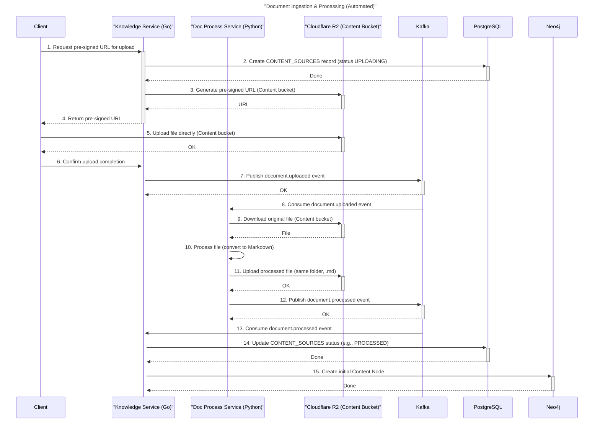
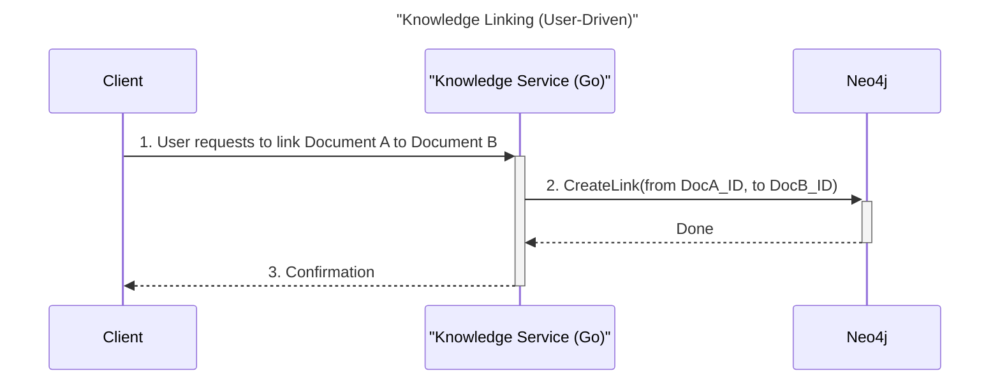

# Knowledge & Document Process Services

## Sequence Diagrams

### Document Ingestion & Processing (Automated)

```mermaid
sequenceDiagram
    participant Client
    participant KS as "Knowledge Service (Go)"
    participant DPS as "Doc Process Service (Python)"
    participant R2 as "Cloudflare R2 (Content Bucket)"
    participant Kafka
    participant PostgreSQL
    participant Neo4j

    title "Document Ingestion & Processing (Automated)"

    Client->>+KS: 1. Request pre-signed URL for upload
    KS->>+PostgreSQL: 2. Create CONTENT_SOURCES record (status UPLOADING)
    PostgreSQL-->>-KS: Done
    KS->>+R2: 3. Generate pre-signed URL (Content bucket)
    R2-->>-KS: URL
    KS-->>-Client: 4. Return pre-signed URL

    Client->>+R2: 5. Upload file directly (Content bucket)
    R2-->>-Client: OK

    Client->>+KS: 6. Confirm upload completion
    KS->>+Kafka: 7. Publish document.uploaded event
    Kafka-->>-KS: OK

    Kafka->>+DPS: 8. Consume document.uploaded event
    DPS->>+R2: 9. Download original file (Content bucket)
    R2-->>-DPS: File
    DPS->>DPS: 10. Process file (convert to Markdown)
    DPS->>+R2: 11. Upload processed file (same folder, .md)
    R2-->>-DPS: OK
    DPS->>+Kafka: 12. Publish document.processed event
    Kafka-->>-DPS: OK

    Kafka->>+KS: 13. Consume document.processed event
    KS->>+PostgreSQL: 14. Update CONTENT_SOURCES status (e.g., PROCESSED)
    PostgreSQL-->>-KS: Done
    KS->>+Neo4j: 15. Create initial Content Node
    Neo4j-->>-KS: Done
```

### Knowledge Linking (User-Driven)

```mermaid
sequenceDiagram
    participant Client
    participant KS as "Knowledge Service (Go)"
    participant Neo4j

    title "Knowledge Linking (User-Driven)"

    Client->>+KS: 1. User requests to link Document A to Document B
    KS->>+Neo4j: 2. CreateLink(from DocA_ID, to DocB_ID)
    Neo4j-->>-KS: Done
    KS-->>-Client: 3. Confirmation
```
