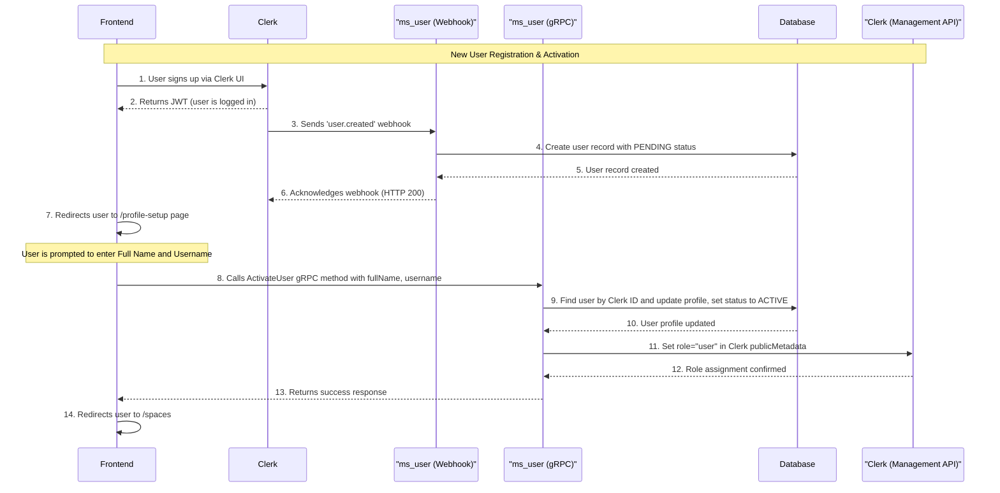
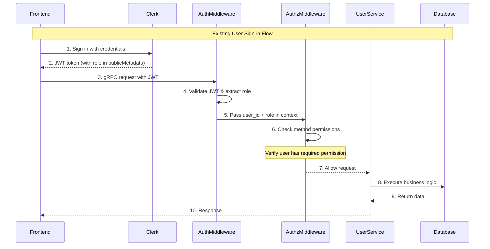
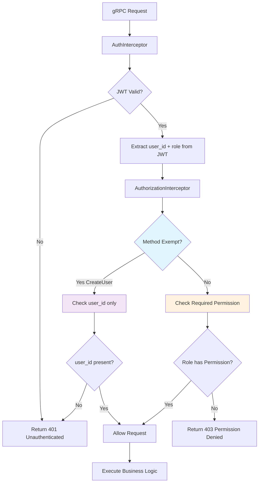
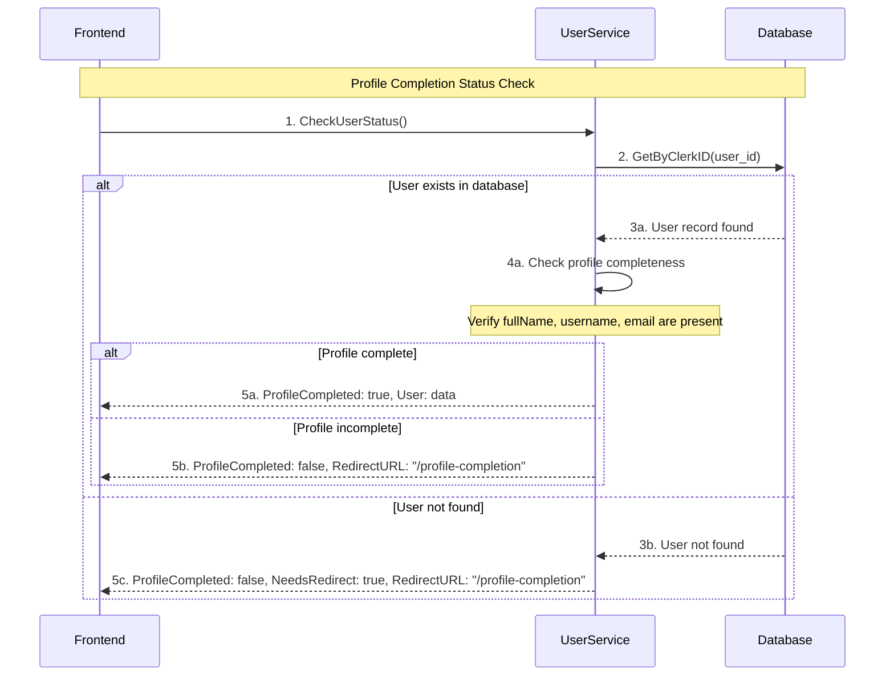
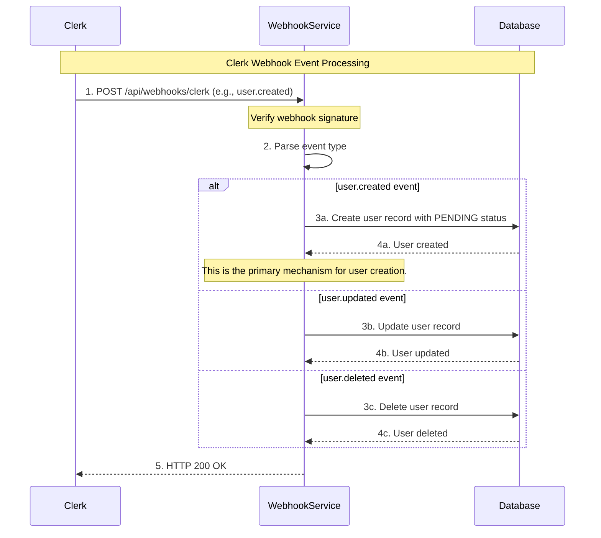

# MS_USER Service

The `ms_user` service is a gRPC-based microservice that handles user management, authentication, and authorization for the Knowledge Exploration and Information Structuring Platform.

## Overview

This service provides:
- User profile management (CRUD operations)
- Role-based access control (RBAC)
- Clerk.com integration for authentication
- User preferences management
- User status and profile completion checks

## Architecture

- **Protocol**: gRPC-First architecture
- **Authentication**: Clerk.com JWT tokens
- **Authorization**: Role-based access control (RBAC)
- **Database**: PostgreSQL with Ent ORM
- **Webhooks**: Clerk webhook handling for user events

## Quick Start

```bash
# Install dependencies
go mod download

# Run the service
go run ./cmd/main.go

# Build binary
go build -o ms_user ./cmd/main.go
```

## Configuration

The service requires the following environment variables:
- `CLERK_SECRET_KEY`: Clerk backend API key

- `DATABASE_URL`: PostgreSQL connection string
- `GRPC_SERVER_PORT`: gRPC server port (default: 50051)
- `WEBHOOK_SERVER_PORT`: HTTP webhook server port (default: 8080)

## Workflows

### User Registration & Profile Activation Flow

This diagram illustrates the end-to-end process from a new user signing up via Clerk to their profile being activated in the system. The creation is handled by a webhook, and the activation is handled by a gRPC call from the frontend after the user provides additional details.



### Existing User Authentication Flow



### Role-Based Access Control (RBAC) Flow



### User Profile Completion Check Flow



### Webhook Event Processing Flow



## API Endpoints

### gRPC Methods

- `CreateUser(email, fullName, username)` - Create user profile
- `GetUser()` - Get current user profile
- `UpdateUser(email?, fullName?, username?)` - Update user profile
- `DeleteUser()` - Soft delete user
- `CheckUserStatus()` - Check profile completion status
- `UpdateUserPreferences(...)` - Update user preferences

### HTTP Endpoints

- `POST /api/webhooks/clerk` - Clerk webhook handler

## Permissions & Roles

### Roles
- `user` - Standard user role (default)
- `admin` - Administrator role

### Permissions
- `user:read` - Read user data
- `user:write` - Write user data
- `user:delete` - Delete user data
- `user:admin` - Administrative operations

### Method Permissions
- `CreateUser` - **EXEMPT** (requires authentication only)
- `GetUser` - `user:read`
- `UpdateUser` - `user:write`
- `DeleteUser` - `user:delete`
- `CheckUserStatus` - `user:read`
- `UpdateUserPreferences` - `user:write`

## Security Features

- JWT token validation via Clerk
- Role-based access control (RBAC)
- Webhook signature verification
- Input validation and sanitization
- Request size limits
- Audit logging for all operations

## Development

### Testing
```bash
go test ./...
```

### Linting
```bash
go vet ./...
```

### Database Migrations
```bash
go run ./cmd/main.go  # Auto-migration on startup
```